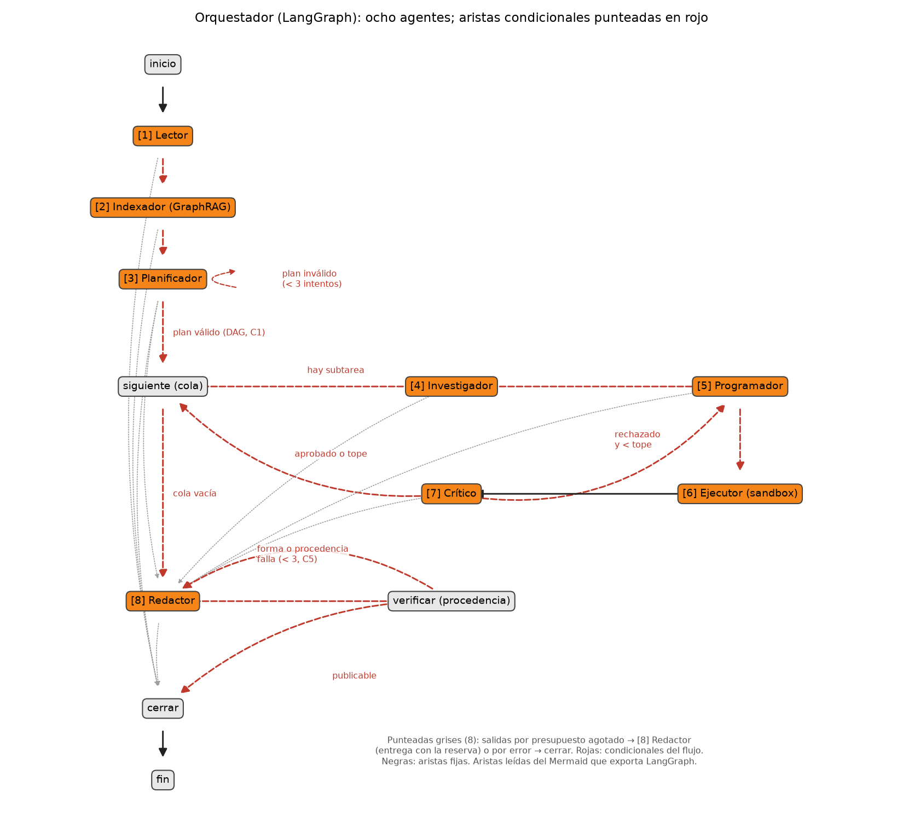

# Taller 03 v2 — Solver multiagente con GraphRAG

MMIA 6013 IA Generativa y Agentes · USFQ · Jessica Ballesteros, Darlyn Ludeña, Miguel Álvarez

Un solver que recibe el enunciado de una tarea en PDF, lo descompone en subtareas, recupera el
contexto de cada una con un grafo de conocimiento (el enunciado y las notas del curso), escribe y
ejecuta código en un sandbox, lo critica, reintenta y redacta el entregable en el formato que pide el
enunciado: Markdown, PDF con límite de páginas o notebook ejecutado. Ninguna cifra se publica si no
salió de una ejecución.

---

## 1. Requisitos

| Qué | Para qué |
|---|---|
| [uv](https://docs.astral.sh/uv/) | entorno e instalación (descarga Python 3.12 si falta) |
| VPN GlobalProtect de la USFQ | el LLM (vLLM, puerto 12555) y los embeddings bge-m3 (Ollama, 11434) de la H200 |
| macOS o Linux | el sandbox mata al grupo de procesos con `killpg` |

Sin VPN solo corren las pruebas, los frenos (Parte 3) y lo que no llama al modelo.

## 2. Instalación

```bash
git clone https://github.com/akroasis0301/taller-03-opcional-alvarez-ballesteros-lude-a.git
cd taller-03-opcional-alvarez-ballesteros-lude-a
uv sync                          # crea .venv con lo fijado en uv.lock
cp .env.example .env             # no lleva claves: la H200 no pide una
```

`.env` (fuera de git) define la ruta a la H200 y los frenos. Los valores de `.env.example` son
los usados en las corridas: presupuesto 500 000 tokens con 50 000 de reserva para el redactor,
3 intentos por subtarea, 120 s por script. El id del modelo **no** se escribe: se lee de `/v1/models`.

Opcional: `uv sync --extra ocr` (PDF escaneados) y `uv sync --extra torch` (la tarea real de la
semana 3, que no está en el golden).

## 3. Verificar el entorno

```bash
uv run pytest -q                                  # 100 pruebas, sin red ni H200
uv run python scripts/verificar_entorno.py        # librerías, LLM y embeddings de la H200 (con VPN)
```

## 4. Resolver una tarea

**Siempre desde la raíz del repositorio.**

```bash
uv run python scripts/correr.py solver-v2/enunciados/tarea-a-generativo-discriminativo.pdf
uv run python scripts/correr.py tareas/reales/semana2/enunciado.pdf --salida corridas/prueba/semana2
uv run python scripts/correr.py <pdf> --variante sin_grafo           # la ablación de la 2.b
```

Tarda de 2 a 25 minutos por tarea: el modelo razona en cada llamada. La primera vez se construye
además el índice de las notas del curso (≈6 min, una sola vez; queda en `cache/graphrag/`). Se puede
construir antes con `uv run python scripts/indexar_notas.py`.

Desde Python, el contrato que pide el enunciado:

```python
from solver.orquestador import Solver
r = Solver().solve("ruta/enunciado.pdf", "corridas/prueba/x")   # status, entregables, subtareas, usage, model, trace
r = Solver().run("ruta/enunciado.pdf")                          # answer, trace, status, model, usage (Taller 4)
```

### Qué deja una corrida

```
corridas/<carpeta>/tarea-X/
├── reporte.md | reporte.pdf | solucion.ipynb   el entregable, en el formato del enunciado
├── output/                    archivos que el enunciado exige con ruta (copiados de una ejecución aprobada)
├── figuras/                   las figuras que cita el entregable
├── traza.jsonl                cada llamada, ejecución y decisión (C6)
├── plan.json                  el plan validado (C1)
├── grafo.json, grafo.png      el grafo del enunciado; grafo_entidades.png: la capa 2 (C2)
├── subtareas/T1/intento-N/    script.py, stdout, stderr, resultados.json de cada intento aprobado
└── cache_solver/              contextos del programador, intentos rechazados, borradores
```

Para leer una traza sin abrir JSON:

```bash
uv run python scripts/evidencia.py corridas/<carpeta>/tarea-X                 # panorama
uv run python scripts/evidencia.py corridas/<carpeta>/tarea-X --subtarea T3   # historia de una subtarea
```

## 5. Reproducir el taller, paso a paso

Todo desde la raíz, con la VPN conectada salvo donde se indica. `scripts/corridas_2b.sh` deja cada
corrida en su carpeta (`corridas/final/<variante>-r<n>/`) y su CSV crudo en `resultados/final/`;
nada se sobrescribe.

| # | Parte | Comando | Tiempo |
|---|---|---|---|
| 1 | 0 | `cd solver-v2 && uv run python parte0/a_llm_sin_ejecutar.py` (también `b_rag_plano.py` y `c_exit_cero.py`, sin VPN) | 2 min |
| 2 | 1, 2.b | `bash scripts/corridas_2b.sh completo 1` y `bash scripts/corridas_2b.sh completo 2` | ≈1 h c/u |
| 3 | 2.b | `bash scripts/corridas_2b.sh sin_grafo 1` y `bash scripts/corridas_2b.sh sin_grafo 2` | ≈45 min c/u |
| 4 | 2.b | `bash scripts/corridas_2b.sh tablas` → `resultados/final/tablas_2b/` | segundos |
| 5 | 3 | `bash scripts/corridas_2b.sh frenos` → `corridas/frenos/` (modelo de guion, **sin VPN**) | 1 min |
| 6 | 4 | `bash scripts/corridas_2b.sh juez` → `resultados/final/juez/` (gemma3 en el Ollama de la H200) | ≈30 min |
| 7 | informe | `uv run python scripts/diagrama_png.py` y `uv run python scripts/informe_pdf.py` → `informe/informe.pdf` | segundos |

Para guardar también lo que se ve en pantalla:

```bash
bash scripts/corridas_2b.sh completo 1 2>&1 | tee resultados/final/salida_completo_r1.txt
```

Durante una corrida larga: la VPN conectada y la computadora despierta (`corridas_2b.sh` usa
`caffeinate` en macOS). Una corrida cortada se repite con el mismo comando: la carpeta anterior se
aparta como `tarea-X.anterior-<fecha>`, no se borra.

### El golden set (Parte 2.a)

```bash
uv run python golden/verdades_reales.py                                    # las verdades de S1 y S2
uv run python solver-v2/evaluar_solver.py --golden golden/golden_tareas.json \
  --solo-evaluar corridas/final/completo-r1 --salida resultados/reevaluacion.csv   # re-evaluar sin correr
```

`golden/golden_tareas.json` tiene 47 comprobaciones: las 25 del kit (tareas A, B, C), A09 y dos
tareas reales (S1, S2). Cada una lleva su `_por_que`; `golden/README.md` las lista.

## 6. Arquitectura



| # | Agente | Hace | Corrección |
|---|---|---|---|
| 1 | Lector | PDF → secciones, tablas y restricciones (formato, límites, archivos exigidos) | — |
| 2 | Indexador | esqueleto `depende_de` por regla + capa 2: entidades, notas del curso, bge-m3, comunidades | C2 |
| 3 | Planificador | subtareas en un DAG validado por código | C1 |
| 4 | Investigador | sección literal + dependencias + búsqueda local y global, con citas | C2 |
| 5 | Programador | un script por subtarea de cálculo, con `resultados.json` | C4 |
| 6 | Ejecutor | corre el script en el sandbox: guarda AST, entorno vacío, `killpg` | C3 |
| 7 | Crítico | comprobaciones de código primero, LLM después | C4 |
| 8 | Redactor | entregable en el formato del enunciado; procedencia de cada cifra | C5 |

Transversal: la traza en todo camino (C6) y los cuatro frenos (`solver/frenos.py` dice dónde vive
cada uno). El detalle interno está en `docs/interfaces.md`.

## 7. Estructura del repositorio

```
solver/          el solver: orquestador, agentes/, sandbox/, graphrag.py, procedencia.py, traza.py
solver-v2/       kit del profesor, intacto: enunciados A-C, parte0/, golden del kit, evaluar_solver.py, h200.py
golden/          nuestro golden set (2.a): golden_tareas.json, verdades_reales.py, README.md
conocimiento/    notas teóricas del curso (s1-s4): la base del GraphRAG
tareas/reales/   tareas reales (Matemáticas y Programación para IA, semanas 1-3) con sus datos
scripts/         correr, corridas_2b.sh, tablas_2b, evidencia, forzar_frenos, juez, diagrama_png, informe_pdf
corridas/        final/ (las medidas), frenos/ (Parte 3), desarrollo/ y anteriores (evidencia de la 2.c)
resultados/      CSV crudos (final/), Entregables_Parte_0/, orquestador.png
informe/         informe.md → informe.pdf, evidencia/
docs/            interfaces.md: configuración, eventos de la traza, cambios
tests/           100 pruebas (sin red)
```

## 8. Problemas frecuentes

| Síntoma | Causa y salida |
|---|---|
| `Sin respuesta de la H200. ¿Está GlobalProtect conectada?` | VPN desconectada |
| `Connection refused` en el 12555 | el vLLM está caído: para desarrollar, `H200_PUERTO=11434` y `H200_MODELO=qwen3:32b` en `.env` (no para las corridas medidas: un solo modelo) |
| `embeddings_lexicos` en la traza | el Ollama de embeddings no respondió; el solver siguió con un respaldo léxico |
| status `parcial` | presupuesto agotado, una subtarea fallida o cifras marcadas: la traza dice cuál (`scripts/evidencia.py`) |
| una corrida tarda más de 20 min | normal en tareas grandes (S2): el modelo razona hasta 65 k tokens por llamada |

## 9. Credenciales y uso honesto

Ninguna clave en el código, las trazas, los scripts generados ni el repositorio: `.env` está fuera de
git y los scripts que escribe el modelo corren con el entorno vacío. Las tareas reales de
`tareas/reales/` se usan solo como banco de prueba del solver, con permiso de quien las escribió;
el informe declara cómo se usó el solver y un asistente de IA.
