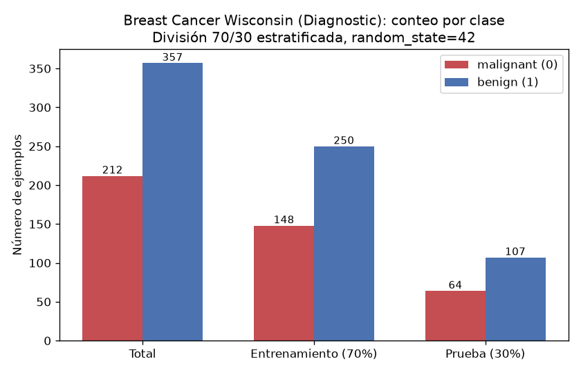
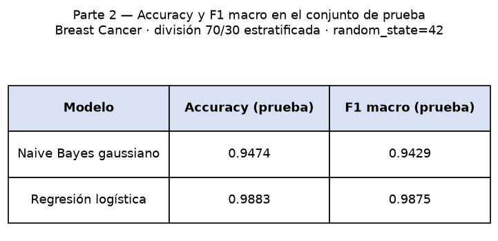
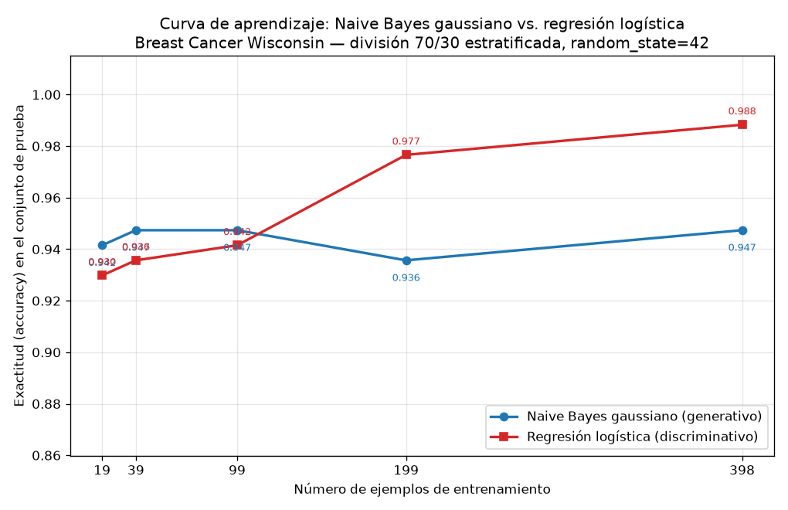
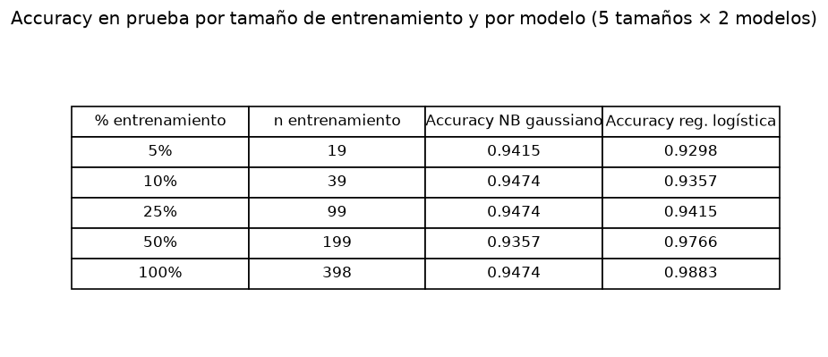

## Introducción

Ng y Jordan (2002) mostraron que un clasificador generativo puede alcanzar su error asintótico con menos ejemplos que su par discriminativo, aunque ese error asintótico sea mayor. Esta tarea comprueba esa predicción sobre datos reales del conjunto Breast Cancer Wisconsin (Diagnostic), enfrentando un Naive Bayes gaussiano (generativo) contra una regresión logística (discriminativa) en una curva de aprendizaje, usando una única división entrenamiento/prueba fijada de antemano.

## Metodología

Se cargó el conjunto con `sklearn.datasets.load_breast_cancer`: 569 ejemplos, 30 atributos, 212 casos de la clase malignant y 357 de benign. Se creó la división 70 %/30 % estratificada por clase con `random_state=42`, que produjo 398 ejemplos de entrenamiento (148 malignant, 250 benign) y 171 de prueba (64 malignant, 107 benign). Esa división es la única usada en toda la tarea: el conjunto de prueba no se tocó para ajustar nada.

Se entrenaron dos clasificadores: un Naive Bayes gaussiano sobre los atributos crudos y una regresión logística con los atributos estandarizados por un `StandardScaler` ajustado únicamente con el entrenamiento. Para la curva de aprendizaje, cada modelo se reentrenó con submuestras estratificadas del 5 %, 10 %, 25 %, 50 % y 100 % del entrenamiento (19, 39, 99, 199 y 398 ejemplos; `random_state=42`); en cada tamaño, el escalador se ajustó solo con la submuestra correspondiente. La evaluación fue siempre sobre el mismo conjunto de prueba de 171 ejemplos, midiendo accuracy y F1 macro.

## Resultados

La distribución de clases del conjunto completo se muestra en la Figura 1.

Sobre el conjunto de prueba, con el entrenamiento completo (Parte 2), los resultados fueron:

| Modelo | Accuracy (prueba) | F1 macro (prueba) |
|---|---|---|
| Naive Bayes gaussiano | 0.9474 | 0.9429 |
| Regresión logística | 0.9883 | 0.9875 |

La curva de aprendizaje (Parte 3) arrojó las siguientes exactitudes sobre el mismo conjunto de prueba:

| Fracción del entrenamiento | n_train | Accuracy NB gaussiano | Accuracy regresión logística |
|---|---|---|---|
| 0.05 | 19 | 0.9415 | 0.9298 |
| 0.10 | 39 | 0.9474 | 0.9357 |
| 0.25 | 99 | 0.9474 | 0.9415 |
| 0.50 | 199 | 0.9357 | 0.9766 |
| 1.00 | 398 | 0.9474 | 0.9883 |

El Naive Bayes gaussiano fue el mejor modelo con 19, 39 y 99 ejemplos (accuracy 0.9415, 0.9474 y 0.9474, frente a 0.9298, 0.9357 y 0.9415 de la regresión logística); la regresión logística fue mejor con 199 y 398 ejemplos (0.9766 y 0.9883, frente a 0.9357 y 0.9474).

## Discusión

Los resultados reproducen el cruce que predicen Ng y Jordan. Con pocos datos (19–99 ejemplos) gana el modelo generativo: el Naive Bayes alcanza ya con 19 ejemplos una accuracy de 0.9415 y con 39 llega a 0.9474, que es esencialmente su valor asintótico (0.9474 también con los 398 ejemplos). Su curva es casi plana: entre 19 y 398 ejemplos la accuracy se mueve solo entre 0.9357 y 0.9474. En cambio, la regresión logística parte de 0.9298 con 19 ejemplos y mejora de forma monótona hasta 0.9883 con 398, superando al Naive Bayes a partir de 199 ejemplos.

La explicación por sesgo y varianza es directa. El Naive Bayes gaussiano impone un sesgo fuerte: asume que los 30 atributos son independientes condicionalmente a la clase, algo falso en estos datos (radio, perímetro y área medios están fuertemente relacionados). Ese sesgo alto reduce drásticamente la varianza: con muy pocos ejemplos ya estima bien sus parámetros (medias y varianzas por atributo y clase) y converge rápido, pero el techo impuesto por la suposición incorrecta limita su error asintótico (accuracy 0.9474). La regresión logística tiene un sesgo menor, porque no modela la distribución conjunta de los atributos y solo ajusta la frontera de decisión; eso la hace más sensible al tamaño de muestra al inicio (varianza mayor: 0.9298 con 19 ejemplos), pero al crecer los datos su varianza disminuye y su menor sesgo le permite alcanzar un error asintótico menor (accuracy 0.9883 y F1 macro 0.9875).

En términos prácticos: con menos de unos 100 ejemplos conviene el generativo; con 199 o más conviene el discriminativo. La pequeña caída del Naive Bayes con 199 ejemplos (0.9357) muestra que su varianza no es nula, aunque recupera 0.9474 con el entrenamiento completo.

## Conclusiones

Sobre Breast Cancer Wisconsin, con la división 70/30 estratificada (398 entrenamiento, 171 prueba), el experimento confirma el patrón de Ng y Jordan: el Naive Bayes gaussiano converge con muy pocos ejemplos (accuracy 0.9474 ya con 39) pero hacia un error asintótico mayor, mientras que la regresión logística necesita más datos (supera al generativo desde 199 ejemplos) y logra un mejor desempeño final (accuracy 0.9883, F1 macro 0.9875). La elección del modelo debe depender del presupuesto de datos: generativo para muestras pequeñas, discriminativo cuando hay datos suficientes.
