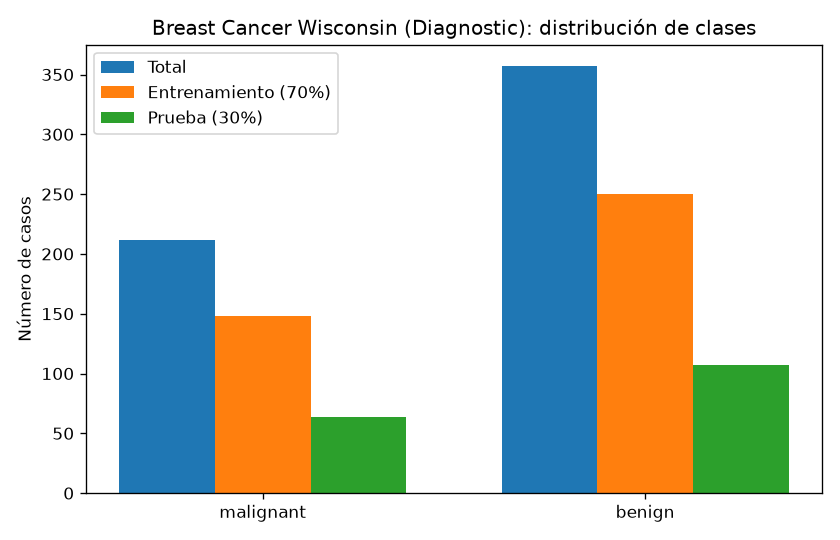
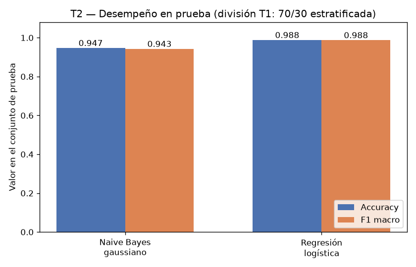
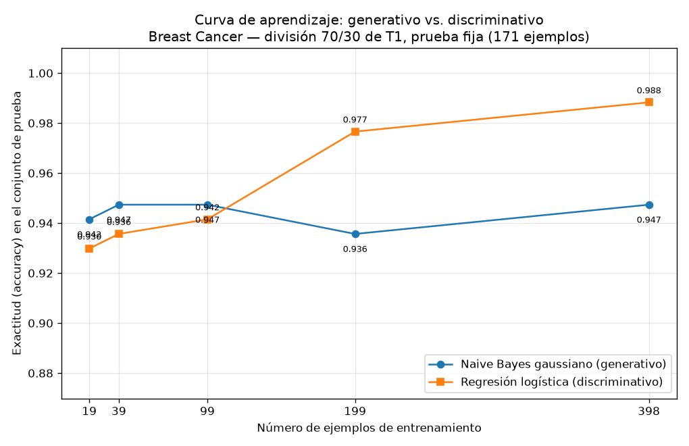

# Tarea A — Generativo contra discriminativo con pocos datos

## Introducción

Ng y Jordan (2002) predijeron que un clasificador **generativo** alcanza su error asintótico con menos ejemplos de entrenamiento que uno **discriminativo**, aunque ese error asintótico sea mayor. Esta tarea comprueba esa predicción sobre datos reales: el conjunto Breast Cancer Wisconsin (Diagnostic) de scikit-learn, enfrentando un Naive Bayes gaussiano (generativo) contra una regresión logística (discriminativo). Se reporta el desempeño de ambos sobre un conjunto de prueba fijo, primero con el entrenamiento completo y luego a lo largo de una curva de aprendizaje con submuestras del 5 % al 100 % del entrenamiento, para identificar en qué régimen de datos conviene cada modelo.

## Metodología

**Datos y división.** Se cargó `sklearn.datasets.load_breast_cancer`: 569 ejemplos, 30 atributos y dos clases, *malignant* (212 casos) y *benign* (357 casos). La distribución se muestra en la Figura 1. Se realizó una única división entrenamiento/prueba 70/30, estratificada por clase y con `random_state=42`, que produce 398 ejemplos de entrenamiento (148 *malignant*, 250 *benign*) y 171 de prueba (64 *malignant*, 107 *benign*), es decir, una proporción de prueba de 0.3005. Esta división es la única de toda la tarea: el conjunto de prueba nunca se usó para ajustar nada.

**Modelos.** (1) Naive Bayes gaussiano (`GaussianNB`, parámetros por defecto, atributos originales sin estandarizar). (2) Regresión logística (`LogisticRegression`, `max_iter=5000`, `random_state=42`) sobre atributos estandarizados con `StandardScaler` ajustado únicamente con el entrenamiento; el conjunto de prueba solo se transformó.

**Evaluación.** Se midieron exactitud (accuracy) y F1 macro sobre el conjunto de prueba de 171 ejemplos. Para la curva de aprendizaje se entrenaron ambos modelos con submuestras estratificadas del 5 %, 10 %, 25 %, 50 % y 100 % del entrenamiento (19, 39, 99, 199 y 398 ejemplos, `random_state=42`) y se evaluó cada uno siempre sobre el mismo conjunto de prueba.

## Resultados

**Parte 2 — Modelos con el entrenamiento completo (398 ejemplos).**

| Modelo | Accuracy | F1 macro |
|---|---|---|
| Naive Bayes gaussiano | 0.9474 | 0.9429 |
| Regresión logística (atributos estandarizados) | 0.9883 | 0.9875 |

La regresión logística supera al Naive Bayes en ambas métricas. En las matrices de confusión, el Naive Bayes comete 7 falsos negativos y 2 falsos positivos, mientras que la regresión logística comete 1 y 1 respectivamente.

**Parte 3 — Curva de aprendizaje.**

| % entrenamiento | n ejemplos | Accuracy NB gaussiano | Accuracy Reg. logística | F1 macro NB gaussiano | F1 macro Reg. logística |
|---|---|---|---|---|---|
| 5 % | 19 | 0.9415 | 0.9298 | 0.9353 | 0.9217 |
| 10 % | 39 | 0.9474 | 0.9357 | 0.9420 | 0.9285 |
| 25 % | 99 | 0.9474 | 0.9415 | 0.9424 | 0.9363 |
| 50 % | 199 | 0.9357 | 0.9766 | 0.9302 | 0.9747 |
| 100 % | 398 | 0.9474 | 0.9883 | 0.9429 | 0.9875 |

## Discusión

**El cruce sí se observa.** Con 19, 39 y 99 ejemplos de entrenamiento el Naive Bayes gaussiano gana: 0.9415 contra 0.9298, 0.9474 contra 0.9357 y 0.9474 contra 0.9415. Con 199 y 398 ejemplos gana la regresión logística: 0.9766 contra 0.9357 y 0.9883 contra 0.9474. El cruce ocurre, por tanto, entre 99 y 199 ejemplos de entrenamiento (entre el 25 % y el 50 % del entrenamiento disponible). El F1 macro sigue exactamente el mismo patrón, lo que descarta que el resultado dependa del desbalance de clases.

**Convergencia rápida del generativo, asíntota más alta del discriminativo.** Las dos predicciones de Ng y Jordan se verifican por separado. Primera predicción: el generativo alcanza su error asintótico con pocos ejemplos. La exactitud del Naive Bayes ya con 19 ejemplos es 0.9415 y en todos los tamaños se mantiene en una banda estrecha, entre 0.9357 y 0.9474; su curva es esencialmente plana desde el inicio, con una pequeña fluctuación en 199 ejemplos atribuible a la varianza de esa submuestra. Segunda predicción: el discriminativo tiene mejor error asintótico. La regresión logística crece de forma monótona en los cinco tamaños (0.9298 → 0.9357 → 0.9415 → 0.9766 → 0.9883) y termina claramente por encima del generativo con los 398 ejemplos completos.

**Sesgo y varianza.** El Naive Bayes gaussiano impone un supuesto fuerte: los 30 atributos son condicionalmente independientes dada la clase. Ese supuesto introduce un **sesgo alto**, pero al requerir solo estimar medias y varianzas por clase y atributo tiene **varianza baja**: con 19 ejemplos ya estima sus parámetros de forma estable y su curva se aplana de inmediato, aunque el sesgo del supuesto de independencia fija un techo de error más alto (0.9474 de exactitud como mejor caso). La regresión logística no asume independencia; ajusta un hiperplano en el espacio de 30 atributos, lo que implica un **sesgo menor** pero una **varianza mayor**: con 19 o 39 ejemplos el ajuste es inestable y su desempeño es inferior al del generativo, pero a medida que aumentan los datos la estimación se vuelve precisa y su curva sigue subiendo hasta 0.9883, sin señales de haberse aplanado del todo. En términos de Ng y Jordan, el generativo "gana la carrera corta" y el discriminativo "gana la carrera larga", exactamente lo que muestran las cifras de la tabla de la Parte 3 y la Figura 3.

## Conclusiones

Sobre Breast Cancer Wisconsin, con la división 70/30 estratificada (`random_state=42`) y evaluación fija en 171 ejemplos de prueba, se reproduce el patrón de Ng y Jordan (2002): el clasificador generativo (Naive Bayes gaussiano) es superior con pocos datos —mejor exactitud y F1 macro con 19, 39 y 99 ejemplos— y alcanza su desempeño asintótico casi de inmediato (entre 0.9357 y 0.9474 en todos los tamaños), mientras que el discriminativo (regresión logística) necesita más ejemplos pero supera al generativo a partir del cruce observado entre 99 y 199 ejemplos y alcanza el mejor desempeño global con el entrenamiento completo (accuracy 0.9883, F1 macro 0.9875, frente a 0.9474 y 0.9429 del generativo). La explicación es coherente con el compromiso sesgo-varianza: el generativo compensa la escasez de datos con un sesgo alto y varianza baja; el discriminativo, con sesgo menor y varianza mayor, aprovecha los datos adicionales para lograr un error asintótico inferior. La recomendación práctica es usar el modelo generativo cuando el presupuesto de etiquetas sea muy limitado y el discriminativo cuando haya datos suficientes.
