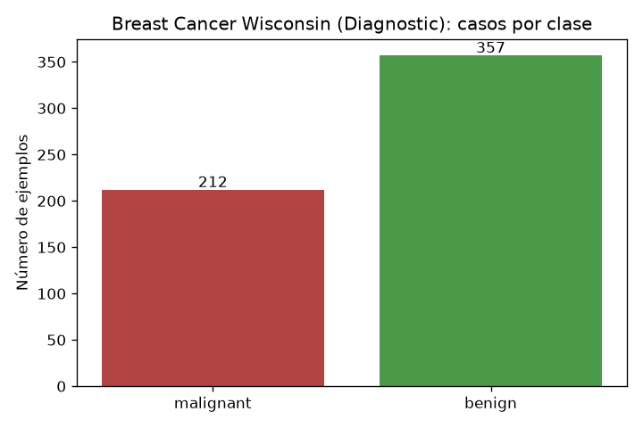
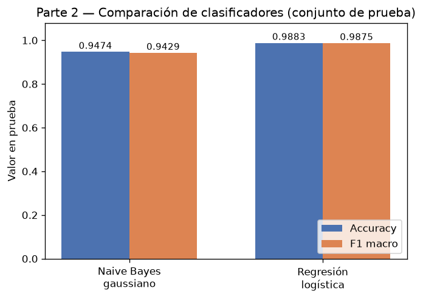
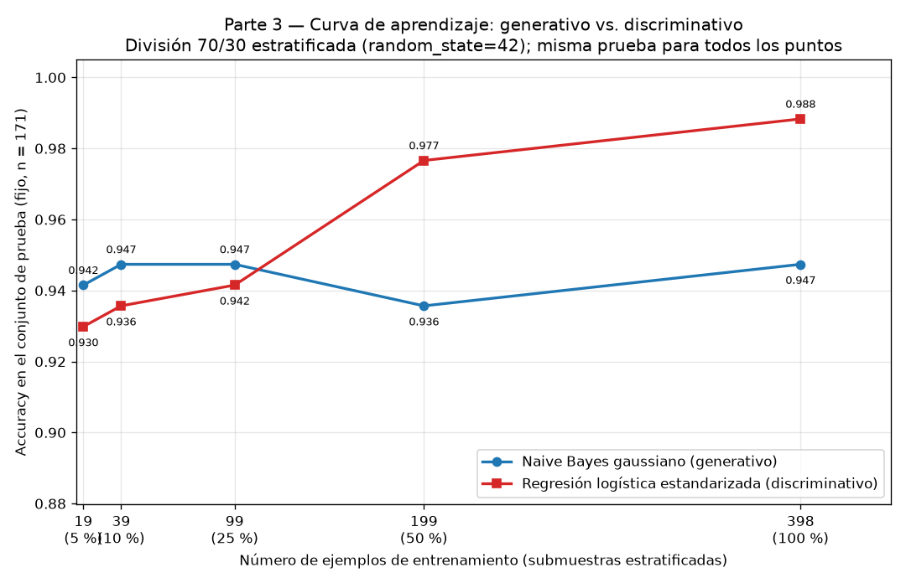

## Introducción

Ng y Jordan (2002) predijeron teóricamente que un clasificador generativo alcanza su error asintótico con menos ejemplos de entrenamiento que uno discriminativo, aunque dicho error asintótico sea peor. Esta tarea comprueba esa predicción sobre datos reales usando el conjunto Breast Cancer Wisconsin (Diagnostic): se enfrentan un Naive Bayes gaussiano (generativo) y una regresión logística (discriminativo) en una curva de aprendizaje sobre una única división entrenamiento/prueba, y se discute el resultado en términos de sesgo y varianza.

## Metodología

**Datos y división.** Se cargó el conjunto Breast Cancer Wisconsin (Diagnostic) de `sklearn.datasets.load_breast_cancer`, con 569 ejemplos y 30 atributos numéricos, en dos clases: malignant con 212 casos (0.3726) y benign con 357 (0.6274). Se creó una única división 70 %/30 % estratificada por clase con `random_state=42`, que dio 398 ejemplos de entrenamiento (148 malignant, 250 benign) y 171 de prueba (64 malignant, 107 benign). El conjunto de prueba no se usó para ajustar nada en ninguna parte de la tarea.

**Modelos.** Se entrenaron dos clasificadores: (1) Naive Bayes gaussiano, sobre los atributos crudos (es invariante a transformaciones afines por atributo, así que no requiere estandarización), y (2) regresión logística con los atributos estandarizados mediante `StandardScaler` ajustado exclusivamente con el conjunto de entrenamiento.

**Evaluación.** Sobre el conjunto de prueba se midieron exactitud (accuracy) y F1 macro. Para la curva de aprendizaje, ambos modelos se reentrenaron con el 5 %, 10 %, 25 %, 50 % y 100 % del entrenamiento (submuestras estratificadas con `random_state=42`, de tamaños 19, 39, 99, 199 y 398 ejemplos; el tamaño trunca hacia abajo), evaluando siempre sobre el mismo conjunto de prueba de 171 ejemplos. El punto de 100 % reproduce exactamente la Parte 2, lo que confirma la consistencia del protocolo.

## Resultados

**Parte 1 — Datos.** La distribución de clases se conserva en ambas particiones: 0.3719 malignant en entrenamiento y 0.3743 en prueba. La figura siguiente muestra la distribución de clases del conjunto completo.

**Parte 2 — Comparación con el entrenamiento completo (398 ejemplos).**

| Modelo | Accuracy (prueba) | F1 macro (prueba) |
|---|---|---|
| Naive Bayes gaussiano | 0.9474 | 0.9429 |
| Regresión logística (atributos estandarizados) | 0.9883 | 0.9875 |

Con todo el entrenamiento, la regresión logística supera al Naive Bayes por 0.0409 de exactitud (0.9883 frente a 0.9474) y por 0.0446 de F1 macro (0.9875 frente a 0.9429).

**Parte 3 — Curva de aprendizaje.** Exactitud en el mismo conjunto de prueba (171 ejemplos) para cada tamaño de entrenamiento:

| % del entrenamiento | n_train | Accuracy — NB gaussiano | Accuracy — Reg. logística |
|---|---|---|---|
| 5 % | 19 | 0.9415 | 0.9298 |
| 10 % | 39 | 0.9474 | 0.9357 |
| 25 % | 99 | 0.9474 | 0.9415 |
| 50 % | 199 | 0.9357 | 0.9766 |
| 100 % | 398 | 0.9474 | 0.9883 |

El Naive Bayes gana con 19 ejemplos (0.9415 contra 0.9298, diferencia 0.0117), con 39 (0.9474 contra 0.9357, diferencia 0.0117) y con 99 (0.9474 contra 0.9415, diferencia 0.0058). La regresión logística gana con 199 (0.9766 contra 0.9357) y con 398 (0.9883 contra 0.9474), en ambos casos con diferencia 0.0409 a su favor. El cruce ocurre entre 99 y 199 ejemplos de entrenamiento.

## Discusión

Los resultados reproducen el patrón de Ng y Jordan. En los tamaños pequeños (19, 39 y 99 ejemplos) el modelo generativo es superior, y a partir de 199 ejemplos el discriminativo lo supera y mantiene la ventaja hasta el entrenamiento completo.

La razón se ve en la forma de las dos curvas. La curva del Naive Bayes es casi plana: pasa de 0.9415 con 19 ejemplos a 0.9474 con 39 y se mantiene en 0.9474 con 99 y 398 (con una única oscilación a 0.9357 con 199, atribuible al ruido de muestreo de la submuestra). Es decir, el generativo alcanza su error asintótico con muy pocos ejemplos: su supuesto de independencia condicional entre atributos es un sesgo fuerte e incorrecto para estos datos (los atributos de radio, perímetro y área están correlacionados), lo que fija un techo de exactitud en torno a 0.9474, pero a cambio reduce drásticamente la varianza: con 30 atributos solo necesita estimar medias y varianzas por atributo y por clase, algo que 19 ejemplos ya bastan para hacer de forma estable.

La curva de la regresión logística, en cambio, crece de forma casi monótona: 0.9298, 0.9357, 0.9415, 0.9766 y 0.9883. Al no imponer la independencia, su sesgo es menor y su error asintótico es mejor (0.9883 con 398 ejemplos), pero estima 30 parámetros conjuntamente mediante optimización, lo que implica mayor varianza: con pocos ejemplos el ajuste es inestable y rinde peor que el generativo. A medida que aumentan los datos, la varianza disminuye y el modelo explota su menor sesgo, superando al Naive Bayes entre 99 y 199 ejemplos y llegando a 0.9883 con el entrenamiento completo.

En resumen: con pocos datos conviene el generativo (menor varianza, converge pronto a un error asintótico más alto); con muchos datos conviene el discriminativo (menor sesgo, error asintótico mejor). Ese es exactamente el cruce predicho.

## Conclusiones

Sobre Breast Cancer Wisconsin con una división 70/30 estratificada (`random_state=42`), el experimento confirma cualitativamente a Ng y Jordan (2002). El Naive Bayes gaussiano, con mayor sesgo y menor varianza, alcanza su meseta de exactitud (0.9474) ya con 39 ejemplos y gana en los regímenes de 19, 39 y 99 ejemplos. La regresión logística, con menor sesgo y mayor varianza, mejora de forma sostenida con el tamaño de entrenamiento (de 0.9298 con 19 a 0.9883 con 398) y supera al generativo a partir de 199 ejemplos, con una ventaja final de 0.0409 de exactitud y 0.0446 de F1 macro. La lección práctica es que la elección entre modelos generativos y discriminativos depende del régimen de datos disponible: con pocas observaciones el generativo es preferible; con datos suficientes, el discriminativo alcanza mejor desempeño.
