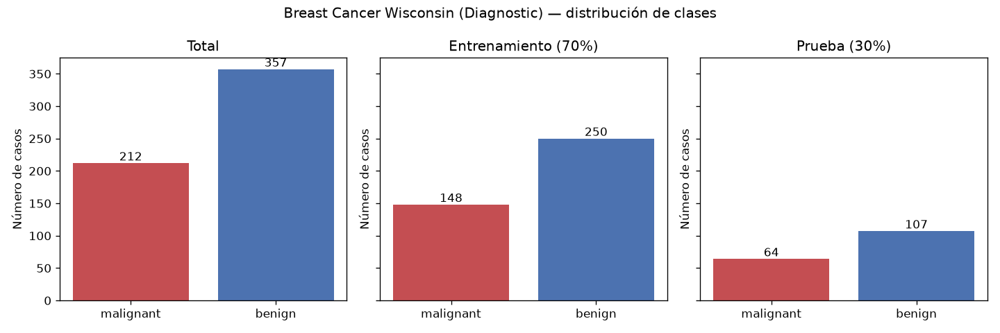
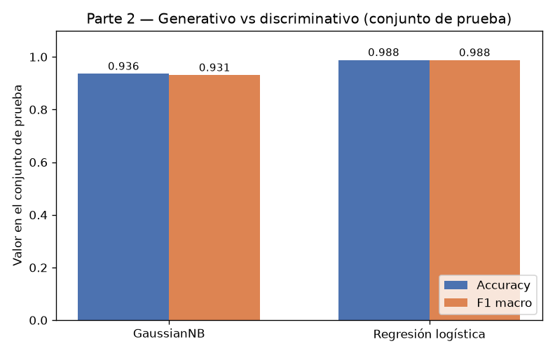
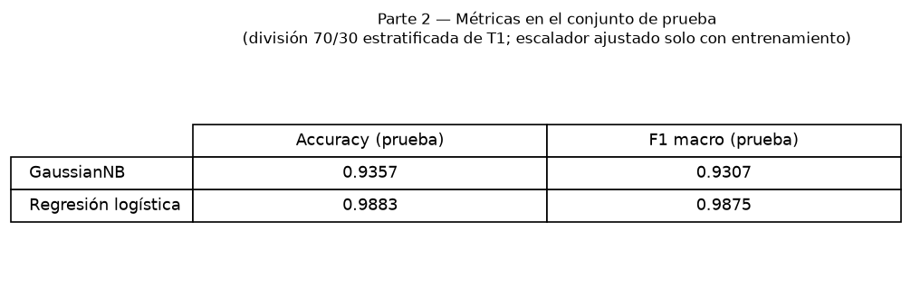
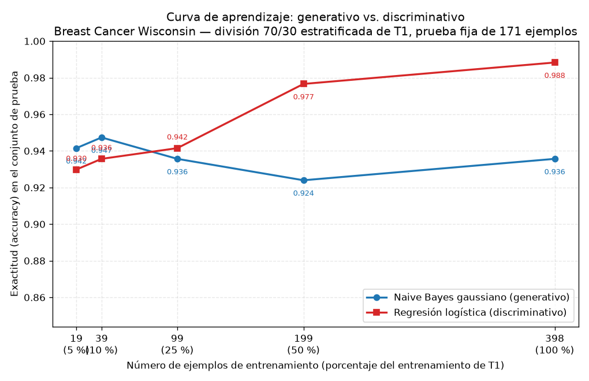

# Generativo contra discriminativo con pocos datos

## Introducción

Ng y Jordan (2002) predijeron teóricamente que un clasificador generativo alcanza su error asintótico con menos ejemplos de entrenamiento que un discriminativo, aunque ese error asintótico sea peor. Esta tarea comprueba esa predicción sobre datos reales: el conjunto Breast Cancer Wisconsin (Diagnostic) de scikit-learn. Se enfrentan un Naive Bayes gaussiano (generativo) y una regresión logística (discriminativa) en una división única 70/30, midiendo exactitud y F1 macro tanto con el entrenamiento completo como con submuestras del 5 % al 100 %, evaluando siempre sobre el mismo conjunto de prueba.

## Metodología

**Datos y división.** Se cargó `load_breast_cancer`: 569 ejemplos, 30 atributos y dos clases, *malignant* (212 casos) y *benign* (357 casos). La división se hizo con `train_test_split(test_size=0.3, random_state=42, stratify=y)`, quedando 398 ejemplos de entrenamiento (148 *malignant*, 250 *benign*; fracción 0.6995) y 171 de prueba (64 *malignant*, 107 *benign*; fracción 0.3005). Esta es la única división de toda la tarea: el conjunto de prueba no se usó para ajustar nada.

**Modelos.** GaussianNB (parámetros por defecto) y LogisticRegression (`max_iter=5000`, `random_state=42`). Los atributos se estandarizaron con `StandardScaler` ajustado solo con el entrenamiento; en la Parte 3, el escalador se reajustó con cada submuestra, nunca con la prueba. GaussianNB es invariante a transformaciones afines por atributo, por lo que estandarizar no altera sus decisiones de forma apreciable; se estandarizó para ambos por consistencia.

**Curva de aprendizaje.** Sobre el entrenamiento de 398 ejemplos se extrajeron submuestras estratificadas del 5 %, 10 %, 25 %, 50 % y 100 % (`random_state=42`), de tamaños 19, 39, 99, 199 y 398 ejemplos. Cada modelo se entrenó con cada submuestra y se evaluó siempre sobre el mismo conjunto fijo de prueba de 171 ejemplos. Se reportan exactitud y F1 macro.

## Resultados

**Parte 2 — Modelos con el entrenamiento completo (398 ejemplos).**

| Modelo | Accuracy (prueba) | F1 macro (prueba) |
|---|---|---|
| Naive Bayes gaussiano (GaussianNB) | 0.9357 | 0.9307 |
| Regresión logística (atributos estandarizados) | 0.9883 | 0.9875 |

La regresión logística supera a GaussianNB en ambos indicadores. En las matrices de confusión (orden 0 = *malignant*, 1 = *benign*), GaussianNB comete 11 errores ([57, 7; 4, 103]) y la regresión logística solo 2 ([63, 1; 1, 106]).

**Parte 3 — Curva de aprendizaje (prueba fija de 171 ejemplos).**

| % del entrenamiento | n ejemplos | Accuracy prueba (GaussianNB) | Accuracy prueba (Reg. logística) |
|---|---|---|---|
| 5 % | 19 | 0.9415 | 0.9298 |
| 10 % | 39 | 0.9474 | 0.9357 |
| 25 % | 99 | 0.9357 | 0.9415 |
| 50 % | 199 | 0.9240 | 0.9766 |
| 100 % | 398 | 0.9357 | 0.9883 |

En F1 macro, GaussianNB obtiene 0.9353, 0.9420, 0.9302, 0.9180 y 0.9307, y la regresión logística 0.9217, 0.9285, 0.9363, 0.9747 y 0.9875, para los mismos tamaños.

## Discusión

**El cruce sí se observa.** Con 19 ejemplos (5 %), GaussianNB gana: 0.9415 contra 0.9298. Con 39 (10 %) también: 0.9474 contra 0.9357. El cruce ocurre entre 39 y 99 ejemplos: con 99 (25 %) la regresión logística ya supera al generativo (0.9415 contra 0.9357) y la brecha crece con los datos, hasta 0.9883 contra 0.9357 con 398 ejemplos (50 %: 0.9766 contra 0.9240). Este es exactamente el patrón de Ng y Jordan: el generativo es mejor en el régimen de pocos datos y el discriminativo lo rebasa a partir de un tamaño intermedio.

**El generativo alcanza pronto su asíntota, y es más baja.** La curva de GaussianNB es esencialmente plana: entre 19 y 398 ejemplos su exactitud oscila en un rango estrecho (máximo 0.9474 con 39, mínimo 0.9240 con 199, 0.9357 con 398). Es decir, con solo 19–39 ejemplos ya está cerca de su desempeño final, pero ese desempeño final (0.9357) es claramente inferior al de la regresión logística (0.9883). La curva de la regresión logística, en cambio, crece de forma casi monótona (0.9298 → 0.9357 → 0.9415 → 0.9766 → 0.9883): necesita más datos, pero los aprovecha para seguir mejorando.

**Sesgo y varianza.** GaussianNB impone un supuesto fuerte: los 30 atributos son condicionalmente independientes dada la clase, y solo estima medias y varianzas por clase y atributo (2 × 30 parámetros por clase). Ese supuesto rara vez se cumple en este conjunto, donde atributos como *mean radius*, *mean perimeter* y *mean area* están fuertemente correlacionados: es un sesgo alto que fija un techo de error asintótico más alto. A cambio, sus estimaciones son estables, con varianza baja, por lo que con 19 o 39 ejemplos ya rinde cerca de su límite. La regresión logística no asume independencia: optimiza la verosimilitud condicional ajustando 30 coeficientes más la intersección, lo que implica un sesgo menor (puede capturar las dependencias entre atributos) pero varianza mayor: con pocos ejemplos los coeficientes están mal estimados y su rendimiento es inferior (0.9298 con 19 ejemplos, por debajo del 0.9415 de GaussianNB). A medida que aumentan los datos, la varianza de la estimación disminuye y su menor sesgo domina, produciendo el cruce y la ventaja final de 0.9883 contra 0.9357.

**Conveniencia por tamaño.** Con menos de unos 99 ejemplos conviene el generativo (mejor en 19 y 39, y empatado en tendencia con 99); a partir de 99 ejemplos conviene el discriminativo, y con 199 o más la diferencia es sustancial (0.9766 contra 0.9240 con 199). En un problema clínico como este, donde cada error en *malignant* es costoso, la regresión logística con el entrenamiento completo es la opción preferible (2 errores frente a 11).

## Conclusiones

Sobre Breast Cancer Wisconsin, los resultados reproducen el hallazgo de Ng y Jordan: el Naive Bayes gaussiano, con alta varianza baja y sesgo alto, alcanza su desempeño casi asintótico con muy pocos ejemplos (0.9415 con 19; 0.9474 con 39), mientras que la regresión logística, con menor sesgo y mayor varianza, lo supera a partir de unos 99 ejemplos y termina con exactitud 0.9883 y F1 macro 0.9875 frente a 0.9357 y 0.9307 del generativo con los 398 ejemplos completos. La lección práctica es que la elección entre generativo y discriminativo depende del presupuesto de datos: con muestras pequeñas el generativo es competitivo y más estable; con datos suficientes, el discriminativo aprovecha mejor la información y logra el menor error.
