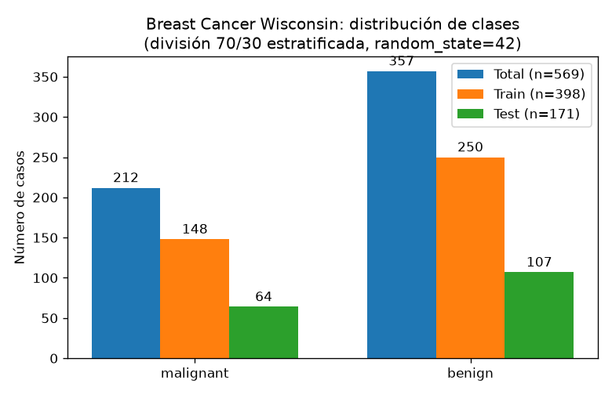
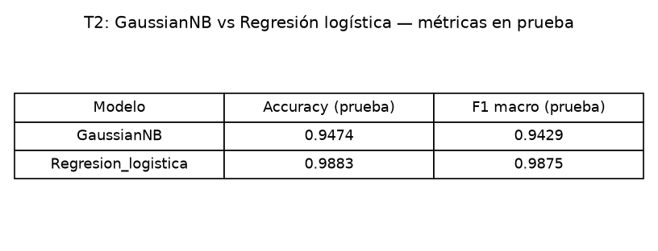
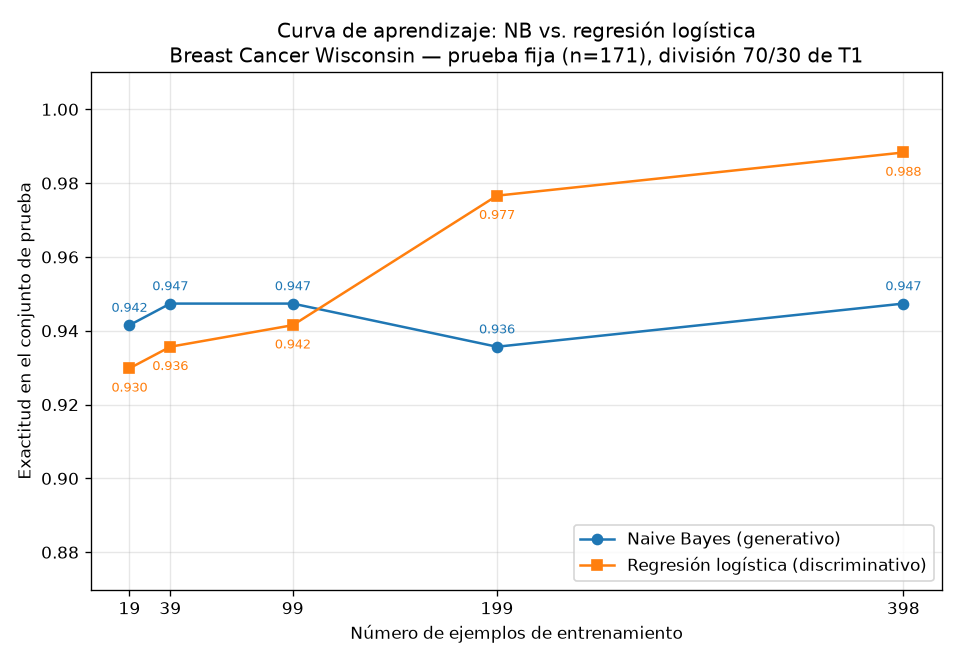

## Introducción

Ng y Jordan (2002) predijeron teóricamente que un clasificador generativo alcanza su error asintótico con menos ejemplos que un discriminativo, aunque ese error asintótico sea mayor. Esta tarea comprueba esa predicción sobre datos reales del conjunto Breast Cancer Wisconsin (Diagnostic), comparando un Naive Bayes gaussiano (generativo) contra una regresión logística (discriminativa) en la división completa y a lo largo de una curva de aprendizaje con submuestras del 5 % al 100 % del entrenamiento.

## Metodología

Se cargó el conjunto Breast Cancer Wisconsin desde `sklearn.datasets.load_breast_cancer`, con 569 ejemplos, 30 atributos y dos clases: 212 casos malignos y 357 benignos. Se creó una única división entrenamiento/prueba 70/30 estratificada por clase con `random_state=42`, que dio 398 ejemplos de entrenamiento (148 malignos, 250 benignos) y 171 de prueba (64 malignos, 107 benignos). El conjunto de prueba no se usó para ajustar nada en ninguna parte de la tarea.

Se entrenaron dos modelos: un GaussianNB sobre los atributos crudos y una regresión logística precedida de un `StandardScaler` ajustado solo con el entrenamiento (`max_iter=5000`, `solver=lbfgs`, `random_state=42`). Ambos se evaluaron sobre el conjunto de prueba con exactitud y F1 macro.

Para la curva de aprendizaje, se reentrenaron ambos modelos con submuestras estratificadas del 5 %, 10 %, 25 %, 50 % y 100 % del entrenamiento (19, 39, 99, 199 y 398 ejemplos; `random_state=42`), evaluando cada tamaño siempre sobre el mismo conjunto de prueba de 171 ejemplos. En cada punto, el escalador de la regresión logística se ajustó solo con la submuestra correspondiente.

## Resultados

Sobre la división 70/30 (398 ejemplos de entrenamiento), las métricas sobre el conjunto de prueba fueron:

| Modelo | Accuracy (prueba) | F1 macro (prueba) |
|---|---|---|
| GaussianNB | 0.9474 | 0.9429 |
| Regresión logística | 0.9883 | 0.9875 |

La matriz de confusión del Naive Bayes fue [[57, 7], [2, 105]] y la de la regresión logística [[63, 1], [1, 106]]: el modelo generativo comete 7 falsos benignos y 2 falsos malignos, mientras que el discriminativo comete un falso benigno y un falso maligno.

La curva de aprendizaje, con exactitud de prueba contra número de ejemplos de entrenamiento, muestra los siguientes valores medidos:

| n entrenamiento | Accuracy GaussianNB | Accuracy Regresión logística |
|---|---|---|
| 19 (5 %) | 0.9415 | 0.9298 |
| 39 (10 %) | 0.9474 | 0.9357 |
| 99 (25 %) | 0.9474 | 0.9415 |
| 199 (50 %) | 0.9357 | 0.9766 |
| 398 (100 %) | 0.9474 | 0.9883 |

## Discusión

Los resultados reproducen el patrón de Ng y Jordan. Con pocos ejemplos gana el generativo: con 19 ejemplos GaussianNB alcanza 0.9415 frente a 0.9298 de la regresión logística; con 39, 0.9474 frente a 0.9357; y con 99, 0.9474 frente a 0.9415. El cruce ocurre entre 99 y 199 ejemplos: con 199 la regresión logística salta a 0.9766 mientras el Naive Bayes se queda en 0.9357, y con los 398 ejemplos completos el discriminativo llega a 0.9883 frente a 0.9474 del generativo. Es decir, el generativo converge pronto a su meseta y el discriminativo lo supera al crecer los datos, exactamente el cruce predicho.

La forma de cada curva refleja el compromiso sesgo–varianza. El Naive Bayes gaussiano tiene alta varianza reducida por construcción: estima solo una media y una varianza por atributo y clase, con pocos parámetros, así que cada ejemplo aporta mucha información y su curva es casi plana desde 19 ejemplos (0.9415–0.9474 en todo el rango, con una leve caída a 0.9357 en 199). Su meseta se alcanza temprano, pero esa meseta es baja: su accuracy asintótico se mantiene en 0.9474. Ese techo es consecuencia de su sesgo alto: la suposición de independencia entre los 30 atributos es claramente falsa en este dataset, donde variables como `mean radius`, `mean perimeter` y `mean area` son casi redundantes; al duplicar su evidencia, el modelo generativo calibra mal las fronteras y comete 7 falsos benignos en la prueba.

La regresión logística, en cambio, tiene menor sesgo: no impone independencia y ajusta 30 coeficientes más el intercepto directamente a la frontera de decisión, lo que le permite un accuracy asintótico mucho mayor (0.9883, con un falso benigno y un falso maligno en prueba). El costo es mayor varianza por muestra: con 19 ejemplos es el peor modelo (0.9298), porque estimar 30 coeficientes más el intercepto con tan pocos datos es inestable. A medida que el tamaño crece (0.9357 con 39, 0.9415 con 99, 0.9766 con 199, 0.9883 con 398), su varianza disminuye de forma monótona y su menor sesgo domina, superando al generativo desde 199 ejemplos.

En términos prácticos: con menos de unos 100 ejemplos conviene el Naive Bayes; a partir de unos 199, la regresión logística. El dataset, con 398 ejemplos de entrenamiento, está del lado donde el discriminativo ya ganó, con una exactitud final de 0.9883 contra 0.9474.

## Conclusiones

Los datos medidos confirman el comportamiento descrito por Ng y Jordan sobre Breast Cancer Wisconsin: el clasificador generativo (GaussianNB) alcanza su error asintótico con muy pocos ejemplos —ya con 39 logra 0.9474, su mejor valor junto con el de 398—, mientras que el discriminativo (regresión logística) parte más bajo con pocos datos (0.9298 con 19) pero mejora de forma sostenida hasta 0.9883 con los 398 disponibles. El cruce de curvas ocurre entre 99 y 199 ejemplos de entrenamiento. La explicación en términos de sesgo y varianza es consistente con las cifras: el generativo tiene sesgo alto (independencia entre atributos) y varianza baja, lo que produce convergencia rápida a un error asintótico mayor; el discriminativo tiene sesgo menor y varianza mayor, lo que exige más datos pero le permite un error final claramente inferior. La elección del modelo debe depender, por tanto, del presupuesto de ejemplos disponible.
