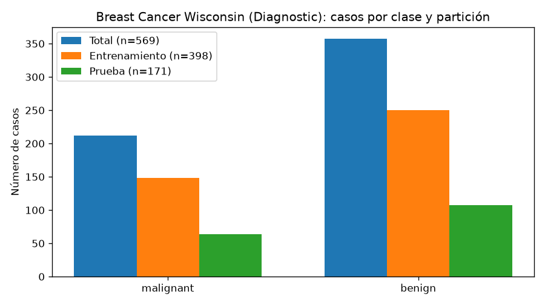
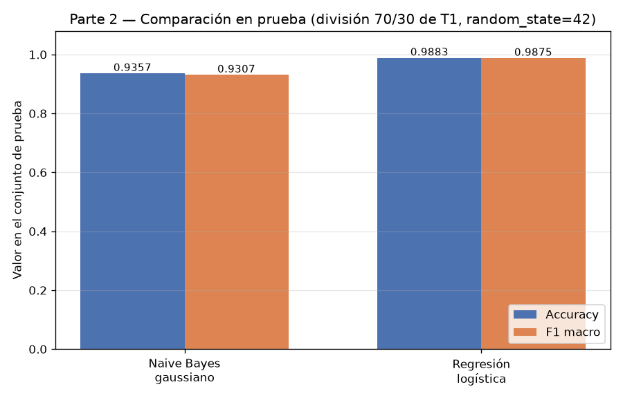
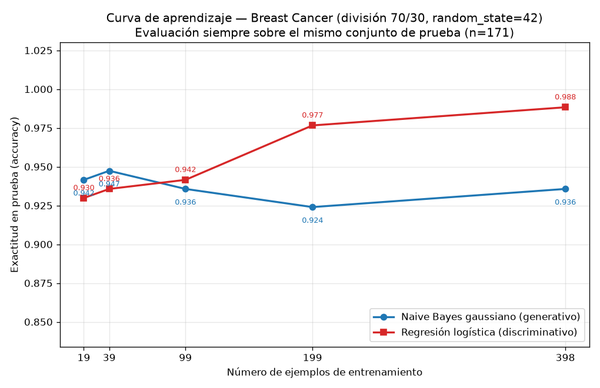

## Introducción

Ng y Jordan (2002) demostraron que un clasificador generativo puede alcanzar su error asintótico con menos ejemplos de entrenamiento que uno discriminativo, aun cuando el error asintótico de este último sea menor. En esta tarea se comprueba esa predicción sobre datos reales del conjunto Breast Cancer Wisconsin (Diagnostic), comparando un modelo generativo (Naive Bayes gaussiano) con uno discriminativo (regresión logística) a medida que crece el tamaño del entrenamiento, evaluando siempre sobre el mismo conjunto de prueba.

## Metodología

**Datos y división.** Se cargó el conjunto con `sklearn.datasets.load_breast_cancer`: 569 ejemplos, 30 atributos, 212 casos malignant (proporción 0.3726) y 357 benign (0.6274). Se realizó una única división 70 %/30 % estratificada por clase con `random_state=42`, usada en toda la tarea: 398 ejemplos de entrenamiento (148 malignant, 250 benign) y 171 de prueba (64 malignant, 107 benign). La estratificación fue correcta: la máxima diferencia de proporciones respecto al total es 0.0017, sin solape entre conjuntos y con su unión cubriendo los 569 ejemplos. El conjunto de prueba no se usó para ajustar nada.

**Modelos.** Se entrenaron un Naive Bayes gaussiano (valores por defecto, `var_smoothing=1e-9`) y una regresión logística (`solver=lbfgs`, `C=1.0`, `max_iter=5000`, `random_state=42`). Los atributos se estandarizaron con `StandardScaler` ajustado solo con el entrenamiento; para el NB la estandarización es invariante de escala y no altera sus predicciones, se aplicó por consistencia con el enunciado.

**Protocolo.** Se midieron exactitud (accuracy) y F1 macro sobre el conjunto de prueba. Para la curva de aprendizaje se entrenaron ambos modelos con submuestras estratificadas del 5 %, 10 %, 25 %, 50 % y 100 % del entrenamiento (`random_state=42`), es decir, 19, 39, 99, 199 y 398 ejemplos, reajustando el escalador con cada submuestra y evaluando siempre sobre el mismo conjunto de prueba de 171 ejemplos.

## Resultados

**Parte 2 — Modelos entrenados con los 398 ejemplos completos.**

| Modelo | Accuracy (prueba) | F1 macro (prueba) |
|---|---|---|
| Naive Bayes gaussiano | 0.9357 | 0.9307 |
| Regresión logística | 0.9883 | 0.9875 |

Las matrices de confusión fueron [[57, 7], [4, 103]] para el NB y [[63, 1], [1, 106]] para la regresión logística: el modelo discriminativo comete 2 errores frente a 11 del generativo.

**Parte 3 — Curva de aprendizaje (exactitud en prueba).**

| n entrenamiento | Accuracy NB gaussiano | Accuracy reg. logística |
|---|---|---|
| 19 | 0.9415 | 0.9298 |
| 39 | 0.9474 | 0.9357 |
| 99 | 0.9357 | 0.9415 |
| 199 | 0.9240 | 0.9766 |
| 398 | 0.9357 | 0.9883 |

Los F1 macro correspondientes son, para el NB, 0.9353, 0.9420, 0.9302, 0.9180 y 0.9307; para la regresión logística, 0.9217, 0.9285, 0.9363, 0.9747 y 0.9875.

## Discusión

Los resultados reproducen el cruce predicho por Ng y Jordan (2002). Con 19 y 39 ejemplos gana el NB (0.9415 contra 0.9298, y 0.9474 contra 0.9357). El cruce ocurre entre 39 y 99 ejemplos: con 99 la regresión logística ya supera al NB (0.9415 contra 0.9357) y la ventaja se amplía con 199 (0.9766 contra 0.9240) y con 398 (0.9883 contra 0.9357).

La forma de las curvas captura la esencia del resultado teórico. La curva del NB es casi plana: entre 19 y 398 ejemplos su exactitud se mueve en una banda estrecha (0.9240–0.9474) y ya con 19 ejemplos está próxima a su valor final (0.9357); alcanza su error asintótico con muy pocos datos. La curva de la regresión logística crece de forma monótona (0.9298 → 0.9357 → 0.9415 → 0.9766 → 0.9883) sin señales de saturación, de modo que su error asintótico es menor que el del generativo.

En términos de sesgo y varianza: el NB gaussiano impone el supuesto de independencia condicional entre los 30 atributos, un sesgo alto que le impide capturar dependencias entre variables y que explica su meseta en 0.9357 con el entrenamiento completo; a cambio estima pocos parámetros (medias y varianzas por atributo y clase), tiene varianza baja y converge rápido. La regresión logística no impone ese supuesto (sesgo menor), pero debe ajustar 30 pesos más el intercepto a partir de los datos, lo que implica varianza mayor: con 19 ejemplos su exactitud (0.9298) solo supera a una de las diez configuraciones medidas (el NB con 199, 0.9240), y solo cuando hay datos suficientes su menor sesgo se traduce en la mejor exactitud (0.9883 con 398 ejemplos). La leve caída del NB en 199 (0.9240) y su recuperación en 398 (0.9357) son fluctuaciones pequeñas dentro de su meseta, coherentes con un modelo de varianza baja ya cercano a su asíntota.

En consecuencia, con presupuestos de datos muy pequeños (hasta unos 39 ejemplos) conviene el modelo generativo; a partir de unos 99 ejemplos conviene el discriminativo, que es además el mejor modelo final en accuracy (0.9883) y F1 macro (0.9875).

## Conclusiones

Sobre Breast Cancer Wisconsin (569 ejemplos, 30 atributos, 212 malignant y 357 benign) y una única división estratificada 70/30 (`random_state=42`, 398 entrenamiento y 171 prueba), se verificó empíricamente la predicción de Ng y Jordan (2002). Con el entrenamiento completo, la regresión logística supera al NB gaussiano (accuracy 0.9883 contra 0.9357; F1 macro 0.9875 contra 0.9307). Sin embargo, en la curva de aprendizaje el generativo gana con 19 y 39 ejemplos y el cruce ocurre entre 39 y 99 ejemplos. El NB, por su alto sesgo y baja varianza, alcanza su error asintótico casi de inmediato; la regresión logística, con menor sesgo y mayor varianza, necesita más datos pero alcanza un error asintótico menor. La recomendación práctica es usar el modelo generativo cuando los datos son muy escasos y el discriminativo cuando hay al menos unos 99 ejemplos de entrenamiento.
