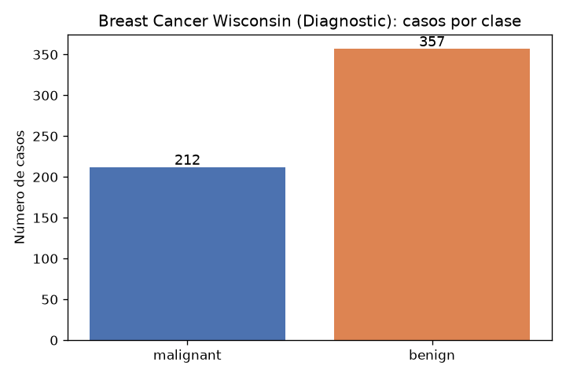
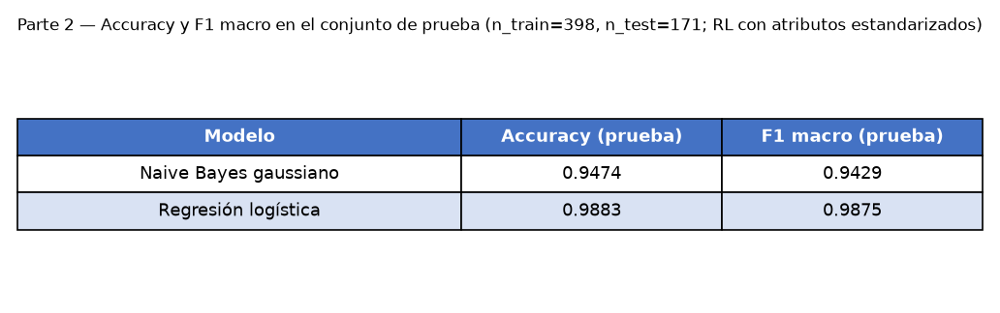
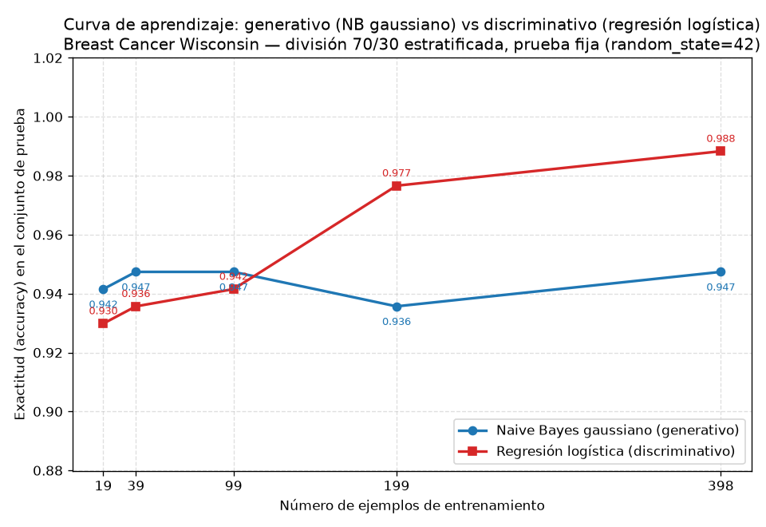

## Introducción

Ng y Jordan (2002) mostraron que un clasificador generativo puede alcanzar su error asintótico con menos ejemplos que uno discriminativo, aunque ese error asintótico sea mayor. Esta tarea comprueba esa predicción sobre datos reales con el conjunto Breast Cancer Wisconsin (Diagnostic), que contiene 569 ejemplos descritos por 30 atributos numéricos, de los cuales 212 son malignos y 357 benignos. Se comparan un modelo generativo (Naive Bayes gaussiano) y uno discriminativo (regresión logística), primero con el entrenamiento completo y luego con submuestras del 5 %, 10 %, 25 %, 50 % y 100 %, para trazar la curva de aprendizaje de cada uno y localizar el cruce predicho.

## Metodología

Los datos se cargan con `sklearn.datasets.load_breast_cancer`. La única división usada en toda la tarea es entrenamiento/prueba 70/30 estratificada por clase con `random_state=42`, que produce 398 ejemplos de entrenamiento (148 malignos, 250 benignos) y 171 de prueba (64 malignos, 107 benignos). El conjunto de prueba no se toca para ajustar nada.

Se entrenan un Naive Bayes gaussiano y una regresión logística; para esta última los atributos se estandarizan con `StandardScaler` ajustado únicamente con el entrenamiento. Se miden accuracy y F1 macro sobre el conjunto de prueba.

Para la curva de aprendizaje se reentrenan ambos modelos con submuestras estratificadas del entrenamiento (`train_test_split` con `stratify=y_train` y `random_state=42`) de 19, 39, 99, 199 y 398 ejemplos, correspondientes al 5 %, 10 %, 25 %, 50 % y 100 %. El escalador se reajusta solo con cada submuestra, nunca con la prueba, y todos los modelos se evalúan siempre sobre el mismo conjunto de prueba de 171 ejemplos. La exactitud contra el número de ejemplos de entrenamiento se grafica con una curva por modelo y se guarda como PNG.

## Resultados

Con el entrenamiento completo (398 ejemplos), la regresión logística supera al Naive Bayes gaussiano en ambas métricas (Tabla 1).

**Tabla 1.** Accuracy y F1 macro sobre el conjunto de prueba (Parte 2).

| Modelo | Accuracy | F1 macro |
|---|---|---|
| Naive Bayes gaussiano | 0.9474 | 0.9429 |
| Regresión logística | 0.9883 | 0.9875 |

La Tabla 2 y la figura de curvas de aprendizaje resumen la Parte 3. Los valores con 398 ejemplos coinciden con la Tabla 1, lo que verifica la consistencia de la evaluación.

**Tabla 2.** Accuracy y F1 macro en prueba según el tamaño de entrenamiento (Parte 3).

| n entrenamiento | NB: accuracy | NB: F1 macro | RL: accuracy | RL: F1 macro |
|---|---|---|---|---|
| 19 | 0.9415 | 0.9353 | 0.9298 | 0.9217 |
| 39 | 0.9474 | 0.9420 | 0.9357 | 0.9285 |
| 99 | 0.9474 | 0.9424 | 0.9415 | 0.9363 |
| 199 | 0.9357 | 0.9302 | 0.9766 | 0.9747 |
| 398 | 0.9474 | 0.9429 | 0.9883 | 0.9875 |

## Discusión

El cruce predicho por Ng y Jordan se observa con claridad. Con entrenamientos pequeños gana el generativo: con 19 ejemplos el Naive Bayes alcanza 0.9415 mientras la regresión logística obtiene 0.9298, y con 39 y 99 ejemplos se mantiene arriba (0.9474 contra 0.9357 y 0.9415). El cruce ocurre entre 99 y 199 ejemplos: con 199 la regresión logística sube a 0.9766 mientras el Naive Bayes cae a 0.9357, y con 398 la regresión logística llega a 0.9883 frente a 0.9474 del generativo.

Las curvas confirman ambos extremos de la predicción. El generativo llega pronto a su meseta: con solo 39 ejemplos ya obtiene 0.9474, el mismo valor que con 398, de modo que su curva es prácticamente plana (el descenso puntual a 0.9357 con 199 ejemplos es ruido de estimación de esa submuestra). El discriminativo mejora de forma monótona: 0.9298, 0.9357, 0.9415, 0.9766 y 0.9883, y su asíntota es más alta que la del generativo.

En términos de sesgo y varianza, el Naive Bayes gaussiano impone un sesgo fuerte: asume que los 30 atributos son independientes condicionalmente a la clase y estima pocos parámetros (media y varianza de cada atributo por clase, más las probabilidades a priori). Ese sesgo reduce la varianza, así que con pocas muestras el modelo ya es estable y alcanza su error asintótico rápido; pero el supuesto de independencia no se sostiene en estos datos, donde atributos como mean radius, mean perimeter y mean area describen la misma magnitud física, y fija un techo de exactitud en torno a 0.9474. La regresión logística no impone ese supuesto: su sesgo es menor, pero debe estimar 30 coeficientes más el intercepto a partir de los datos, lo que aumenta la varianza cuando hay pocos ejemplos; por eso parte por debajo (0.9298 con 19 ejemplos) y necesita más datos para estabilizarse. Con 199 o más ejemplos la varianza queda controlada y su menor sesgo le permite superar al generativo y llegar a 0.9883.

En síntesis: con hasta 99 ejemplos conviene el generativo; a partir de unos 199 conviene el discriminativo, y con el entrenamiento completo la regresión logística es mejor en accuracy (0.9883 contra 0.9474) y en F1 macro (0.9875 contra 0.9429).

## Conclusiones

El experimento reproduce el resultado de Ng y Jordan sobre datos reales. El clasificador generativo alcanza su error asintótico con pocos ejemplos: con 39 ya obtiene su mejor exactitud (0.9474), la misma que con 398. El discriminativo parte más bajo con pocas muestras (0.9298 con 19) pero mejora de manera sostenida hasta 0.9883 con los 398 ejemplos disponibles, y el cruce de curvas ocurre entre 99 y 199 ejemplos. La explicación es el intercambio sesgo-varianza: el generativo compensa la escasez de datos con un sesgo fuerte (independencia condicional entre atributos) que limita su desempeño final; el discriminativo, con menor sesgo y mayor varianza inicial, aprovecha los datos adicionales. Para este problema, con el entrenamiento completo de 398 ejemplos, la regresión logística es la elección preferente (accuracy 0.9883, F1 macro 0.9875); si solo se dispusiera de una fracción pequeña del entrenamiento (hasta 99 ejemplos), el Naive Bayes gaussiano sería la mejor opción.
