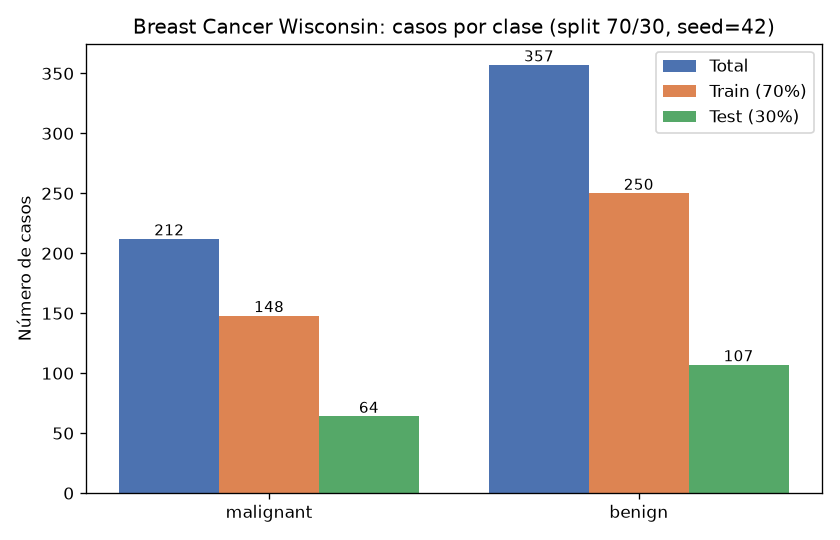
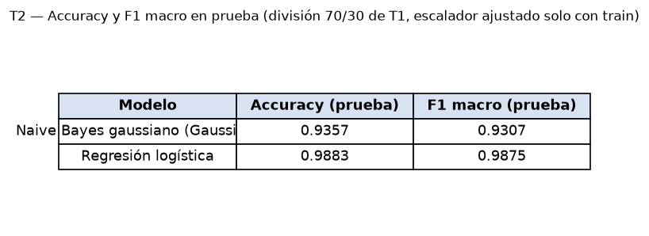
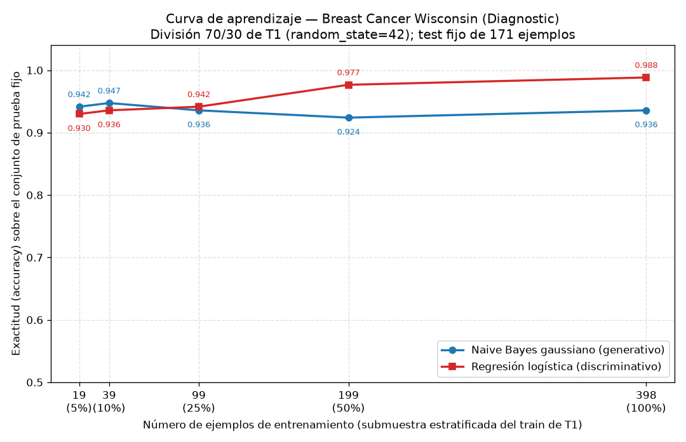

## Introducción

Ng y Jordan (2002) predijeron teóricamente que un clasificador generativo alcanza su error asintótico con menos ejemplos de entrenamiento que un clasificador discriminativo, aunque dicho error asintótico sea mayor. Esta tarea comprueba esa predicción sobre datos reales usando el conjunto Breast Cancer Wisconsin (Diagnostic): se enfrentan un Naive Bayes gaussiano (generativo) y una regresión logística (discriminativa) en una curva de aprendizaje sobre una única división train/test, con el conjunto de prueba reservado y jamás usado para ajustar nada.

## Metodología

Se cargó `load_breast_cancer` de scikit-learn (569 ejemplos, 30 atributos; 212 casos *malignant* y 357 *benign*). Se creó la única división de la tarea: 70 % entrenamiento / 30 % prueba, estratificada por clase y con `random_state=42`, lo que produce 398 ejemplos de entrenamiento (148 malignos, 250 benignos) y 171 de prueba (64 malignos, 107 benignos). Las proporciones de clase se preservan con una diferencia máxima de 0.0024 entre train y test.

Se entrenaron dos modelos: un `GaussianNB` y una `LogisticRegression(max_iter=1000)` sobre atributos estandarizados con `StandardScaler` ajustado únicamente con el conjunto de entrenamiento (el test no participó en el ajuste). Se midieron exactitud (accuracy) y F1 macro sobre el conjunto de prueba.

Para la curva de aprendizaje, ambos modelos se reentrenaron con submuestras estratificadas del 5 %, 10 %, 25 %, 50 % y 100 % del entrenamiento (19, 39, 99, 199 y 398 ejemplos; `random_state=42`), reajustando el escalador solo con cada submuestra, y se evaluó cada tamaño siempre sobre el mismo conjunto de prueba fijo de 171 ejemplos. La corrida al 100 % reproduce exactamente los resultados de la Parte 2 (diferencia absoluta 0.0 en ambos modelos), lo que verifica la consistencia del protocolo.

## Resultados

**Parte 1 — Datos.** El conjunto tiene 569 ejemplos y 30 atributos, con 212 casos *malignant* y 357 *benign*. La división 70/30 estratificada dejó 398 ejemplos de entrenamiento y 171 de prueba.

**Parte 2 — Clasificadores con el entrenamiento completo (398 ejemplos).**

| Modelo | Accuracy | F1 macro |
|---|---|---|
| Naive Bayes gaussiano (GaussianNB) | 0.9357 | 0.9307 |
| Regresión logística | 0.9883 | 0.9875 |

Las matrices de confusión sobre el test (171 ejemplos) muestran para Naive Bayes ([[57, 7], [4, 103]]) 7 falsos benignos y 4 falsos malignos, frente a la regresión logística ([[63, 1], [1, 106]]), con un solo error de cada tipo.

**Parte 3 — Curva de aprendizaje** (accuracy sobre el test fijo de 171 ejemplos):

| n_train | Fracción | Naive Bayes (accuracy) | Reg. logística (accuracy) |
|---|---|---|---|
| 19 | 5 % | 0.9415 | 0.9298 |
| 39 | 10 % | 0.9474 | 0.9357 |
| 99 | 25 % | 0.9357 | 0.9415 |
| 199 | 50 % | 0.9240 | 0.9766 |
| 398 | 100 % | 0.9357 | 0.9883 |

En F1 macro los valores son: Naive Bayes 0.9353, 0.9420, 0.9302, 0.9180, 0.9307; regresión logística 0.9217, 0.9285, 0.9363, 0.9747, 0.9875, para los mismos tamaños crecientes.

## Discusión

Los datos reproducen el cruce que predicen Ng y Jordan. Con pocos ejemplos, el modelo generativo gana: con 19 ejemplos Naive Bayes alcanza 0.9415 de accuracy frente a 0.9298 de la regresión logística, y con 39 ejemplos la relación se mantiene (0.9474 contra 0.9357). El cruce ocurre entre 39 y 99 ejemplos: con 99 la regresión logística ya supera al Naive Bayes (0.9415 contra 0.9357). A partir de ahí la brecha se amplía: con 199 ejemplos la regresión logística alcanza 0.9766 frente a 0.9240, y con los 398 ejemplos completos 0.9883 frente a 0.9357.

La lectura en términos de sesgo y varianza es directa. El Naive Bayes gaussiano tiene varianza baja: sus parámetros (una media y una varianza por atributo y clase) se estiman de forma estable incluso con 19 ejemplos, y su accuracy ya se sitúa cerca de su régimen asintótico desde el primer punto de la curva (0.9415 con 19 ejemplos frente a 0.9357 con 398; de hecho, con 39 ejemplos supera su valor final). Sin embargo, paga ese precio con un sesgo alto: la suposición de independencia condicional entre los 30 atributos y la gaussianidad por atributo no se cumplen en estos datos, y eso fija su error asintótico en un nivel claramente peor (0.9357 de accuracy y 0.9307 de F1 macro, con 7 y 4 errores de cada tipo en la matriz de confusión). Añadir más datos no corrige un sesgo estructural; por eso su curva es casi plana e incluso fluctúa (0.9240 con 199 ejemplos).

La regresión logística tiene el comportamiento complementario. Al no imponer independencia condicional, su sesgo es menor y su error asintótico mejor (0.9883 de accuracy y 0.9875 de F1 macro, con un solo error de cada tipo en test), pero estima muchos más parámetros correlacionados, lo que implica mayor varianza con muestras pequeñas: con 19 ejemplos es el peor modelo de la comparación. Conforme crece el entrenamiento, su varianza se reduce y la curva asciende de forma casi monótona (0.9298 → 0.9357 → 0.9415 → 0.9766 → 0.9883), sin señal de saturación prematura.

En consecuencia, el tamaño de entrenamiento óptimo para cada modelo es: Naive Bayes conviene por debajo de unos 99 ejemplos (en esta tarea, con 19 y 39 ejemplos), mientras que la regresión logística conviene desde 99 ejemplos en adelante, y es la única opción razonable cuando se dispone del entrenamiento completo. Este es exactamente el patrón cualitativo de Ng y Jordan: el generativo converge más rápido pero a un techo peor; el discriminativo converge más lento pero a un techo mejor.

## Conclusiones

Sobre Breast Cancer Wisconsin, con una única división 70/30 estratificada (`random_state=42`) y un test fijo de 171 ejemplos, se verificó el fenómeno de Ng y Jordan: el Naive Bayes gaussiano alcanza su rendimiento casi asintótico con muy pocos datos (0.9415 de accuracy con solo 19 ejemplos) pero con un techo limitado por su sesgo (0.9357 con 398 ejemplos), mientras que la regresión logística parte por debajo con pocos datos (0.9298 con 19) y lo supera a partir de unos 99 ejemplos, llegando a 0.9883 de accuracy y 0.9875 de F1 macro con el entrenamiento completo. La elección del modelo debe depender, por tanto, del presupuesto de datos: generativo para muestras muy pequeñas, discriminativo cuando hay datos suficientes.
