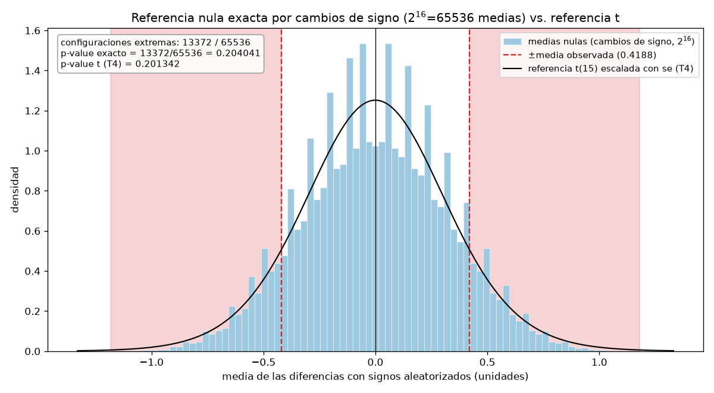
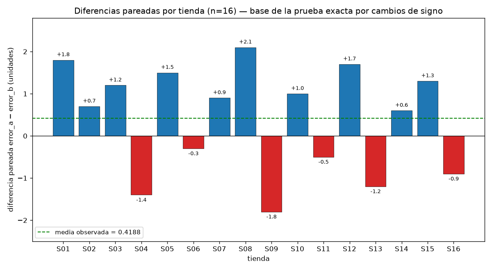

# Informe — Comparación defendible de dos modelos sobre tiendas pareadas

**Curso:** Matemáticas y Programación para IA (MMIA 6013) · Ejercicio de refuerzo, Semana 2 · Entrega individual.

> **Declaraciones obligatorias del solver**
> - **La subtarea T7 (Tarea 7) no tiene resultado (pendiente): no se reportan sus cifras.** La corrida única del pipeline de extremo a extremo no llegó a medirse; los artefactos `output/store_differences.csv` y `output/store_differences.png` que se citan provienen de las ejecuciones parciales de T2 y T3, no de esa corrida única.
> - **El presupuesto de tokens se agotó: se entrega lo que se alcanzó a medir** (subtareas T1–T6; la pregunta 18 se redacta exclusivamente con las cifras medidas de T2–T6).

## Parte 1. Contrato de análisis previo

*Contrato definido antes de ejecutar cualquier prueba estadística (Tarea 1).*

### 1. ¿Qué dos modelos se comparan?

Se comparan dos modelos de regresión ya entrenados, **A y B**, que pronostican la demanda semanal de las mismas 16 tiendas. De cada modelo se observa el error absoluto de pronóstico —columnas `error_a` y `error_b` de `data/model_errors.csv`—, medido en unidades vendidas. La comparación solo es defendible si ambos modelos se evalúan sobre las mismas unidades (tiendas), lo que motiva el diseño pareado.

### 2. ¿Qué población o proceso objetivo propone para interpretar el ejercicio?

Proceso objetivo propuesto: el proceso de pronóstico semanal de demanda de una red de tiendas comparables, en el que cada tienda genera un error de pronóstico para cada modelo y el interés es la diferencia sistemática de errores entre modelos sobre ese proceso (Δ = E(d_i)). Lo que impide afirmar que los datos sintéticos representan realmente esa población es su procedencia: son **sintéticos, deterministas y creados para la actividad**; no provienen de tiendas reales ni constituyen evidencia sobre una empresa, mercado o población existente. Además, las 16 tiendas no provienen de un muestreo aleatorio con marco definido, de modo que la "población" es una construcción didáctica, no una afirmación empírica.

### 3. ¿Cuál es la métrica principal y qué dirección representa un mejor resultado?

La métrica principal es el **error absoluto de pronóstico, en unidades vendidas**. La dirección favorable es **"menor es mejor"**: un error menor representa un mejor pronóstico.

### 4. ¿Cuál es la unidad de análisis?

La **tienda pareada**: cada `store_id` aporta exactamente un par (error_a, error_b) y, derivado de él, una única diferencia d_i. El análisis opera sobre las n = 16 diferencias, no sobre los 32 errores como si fueran independientes.

### 5. ¿Por qué las observaciones están emparejadas y cómo verificará los pares?

Están emparejadas porque ambos modelos pronostican **las mismas tiendas**: dentro de una tienda, los errores de A y B comparten condiciones (demanda, ubicación, estacionalidad) y no son independientes; cada tienda actúa como su propio control. Verificación: indexaré `error_a` y `error_b` por `store_id`, comprobaré que ambos índices contengan exactamente las mismas tiendas sin duplicados ni nulos, y calcularé `difference` sobre claves alineadas por `store_id`, nunca por posición. La ejecución posterior confirmó este contrato: 16 pares validados, mismas tiendas en ambas columnas (Pregunta 11).

### 6. Defina el estimando y la diferencia por tienda

Estimando: **Δ = E(d_i)**, la media poblacional de las diferencias por tienda **d_i = e_A(i) − e_B(i)**. Una **diferencia positiva** significa que el error de A supera al de B en esa tienda; como menor error es mejor, **una diferencia positiva favorece a B**. Una diferencia negativa favorece a A; una diferencia exactamente 0 sería un empate.

### 7. Escriba la hipótesis nula y la alternativa bilateral

**H0: Δ = 0** (el error medio de ambos modelos es igual). **H1: Δ ≠ 0** (bilateral).

### 8. ¿Cuál será el procedimiento principal y qué supuestos requiere?

**Prueba t de una muestra sobre el vector de diferencias, alternativa bilateral** (equivalente a la t pareada). Supuestos: (i) independencia entre tiendas; (ii) diferencias con media Δ y distribución aproximadamente normal, o n suficiente para aproximar la distribución de la media; (iii) escala continua de la métrica; (iv) emparejamiento correcto verificado por tienda.

### 9. ¿Qué resultados reportará además del p-value?

n, media, desviación estándar muestral y error estándar de las diferencias; estadístico t, grados de libertad e intervalo t bilateral del 95 %; conteo de tiendas que favorecen a cada modelo con las diferencias de mayor magnitud (figura por tienda con referencia en cero); referencia exacta por cambios de signo (total de configuraciones, conteo de extremas y su p-value); e intervalo bootstrap percentil del 95 % con semilla y número de remuestras. La conclusión no se reducirá a "significativo/no significativo".

### 10. ¿Qué afirmaciones no permite realizar este diseño?

No permite: afirmar causalidad ni superioridad operativa "en producción" de un modelo; generalizar a tiendas, mercados o periodos reales (datos sintéticos y deterministas); interpretar el p-value como la probabilidad de que H0 sea verdadera; equiparar "no rechazar H0" con "los modelos son iguales"; extrapolar a tiendas no observadas; ni cuantificar beneficios de negocio, pues la métrica es error de pronóstico y no costo ni venta.

## Parte 2. Auditoría y evidencia por tienda

### 11. Confirme que los 16 pares fueron validados mediante store_id

Auditoría medida sobre `data/model_errors.csv` (sha256 `cdd1af7ad3a6ee8f49a14f48ea2d8347591e85388a222b2a83b9d661ae95d7a2`; **archivo original no modificado**): se encontraron **exactamente** las columnas `store_id`, `error_a`, `error_b`; **16 filas**; `store_id` sin nulos y sin duplicados; errores numéricos, finitos y no negativos, sin incidencias en ninguna de las seis categorías validadas. El emparejamiento se validó **por `store_id`**: ambas columnas se indexaron por esa clave, se comprobó que contienen exactamente las mismas 16 tiendas (S01–S16) y `difference` se calculó sobre claves alineadas, no por posición; **n_pares = 16**, con `difference` recalculada sin discrepancias. La tabla pareada se guardó en `output/store_differences.csv` y la figura en `output/store_differences.png` (ejecuciones parciales de T2–T3; la corrida única de T7 queda pendiente, véase la declaración inicial).

**Por qué la longitud no basta:** `len(error_a) == len(error_b)` solo verifica la cantidad de valores. En la demostración de T2, al permutar `error_b` las longitudes seguían siendo 16 == 16, pero **15 de las 16 posiciones** quedaron con el `error_b` de otra tienda; las cuentas por posición habrían sido **8 a A, 7 a B y 1 empate**, frente a las correctas cruzando por `store_id` (**6 a A, 10 a B, 0 empates**). El emparejamiento —y cada conclusión por tienda— puede romperse sin que ninguna verificación de longitud lo detecte; la garantía la da el cruce por `store_id`.

Tabla pareada construida (difference = error_a − error_b; favors = "B" si difference > 0, "A" si difference < 0):

| store_id | error_a | error_b | difference | favors |
|---|---|---|---|---|
| S01 | 12.4 | 10.6 | 1.8 | B |
| S02 | 9.8 | 9.1 | 0.7 | B |
| S03 | 15.1 | 13.9 | 1.2 | B |
| S04 | 11.0 | 12.4 | -1.4 | A |
| S05 | 8.7 | 7.2 | 1.5 | B |
| S06 | 13.6 | 13.9 | -0.3 | A |
| S07 | 10.2 | 9.3 | 0.9 | B |
| S08 | 14.9 | 12.8 | 2.1 | B |
| S09 | 7.5 | 9.3 | -1.8 | A |
| S10 | 16.0 | 15.0 | 1.0 | B |
| S11 | 9.3 | 9.8 | -0.5 | A |
| S12 | 12.8 | 11.1 | 1.7 | B |
| S13 | 11.7 | 12.9 | -1.2 | A |
| S14 | 8.9 | 8.3 | 0.6 | B |
| S15 | 13.2 | 11.9 | 1.3 | B |
| S16 | 10.6 | 11.5 | -0.9 | A |

### 12. Tiendas que favorecen a A y a B, empates y diferencias de mayor magnitud

**6 tiendas favorecen a A** (S04, S06, S09, S11, S13, S16) y **10 favorecen a B** (S01, S02, S03, S05, S07, S08, S10, S12, S14, S15); **no hay empates** (0 tiendas con difference = 0). Diferencias de mayor magnitud en cada dirección: a favor de B, **S08 con difference = +2.1** (error_a 14.9 frente a error_b 12.8); a favor de A, **S09 con difference = −1.8** (error_a 7.5 frente a error_b 9.3). En la Figura 1 se aprecian 10 barras positivas frente a 6 negativas, con la barra más larga hacia B en S08 y la más larga hacia A en S09, siempre con la referencia visible en cero.

## Parte 3. Efecto e incertidumbre

### 13. n, diferencia media, desviación estándar muestral y error estándar

| Cantidad | Valor (unidades vendidas) |
|---|---|
| n (tiendas) | 16 |
| media (mean) | 0.4187 |
| desviación estándar muestral (sample_sd, ddof = 1) | 1.2534 |
| error estándar (SE = sd/√n) | 0.3133 |

El SE fue verificado contra `scipy.stats` (`sem`): 0.3133, consistente con sd/√n = 1.2534/√16.

**Interpretación del signo y la magnitud:** la diferencia media es **+0.4187 unidades vendidas por tienda**. El signo positivo indica que, en promedio, el error absoluto de A excede al de B; bajo la convención "menor error es mejor", ese signo **favorece a B**. La magnitud es modesta frente a la dispersión entre tiendas: las diferencias individuales van de −1.8 (S09) a +2.1 (S08).

**Dispersión entre tiendas vs. error estándar:** la desviación muestral (1.2534) describe cuánto se aleja típicamente *una tienda cualquiera* de la media y no disminuye al acumular tiendas de la misma población; el error estándar (0.3133) describe la incertidumbre de la *media muestral* como estimación de Δ, es √16 = 4 veces menor que la sd y sí se reduce al aumentar n. Confundirlos llevaría a sobrestimar la precisión de tiendas individuales o a subestimar la variabilidad real del efecto entre tiendas.

### 14. Intervalo t del 95 %

**IC t bilateral del 95 %: [−0.2491, 1.0866]** unidades, con t crítico = 2.1314, gl = 15 y margen de error = 0.6679.

Bajo el modelo utilizado (16 diferencias i.i.d. con media Δ y aproximación normal, calibración t con 15 gl), los valores del efecto compatibles con los datos al 95 % son **Δ ∈ [−0.2491, 1.0866]**. Como el intervalo **contiene 0**, un efecto nulo sigue siendo compatible con los datos; efectos de hasta 1.0866 unidades a favor de B, o de hasta 0.2491 unidades a favor de A, tampoco quedan descartados. Interpretación correcta: el *procedimiento* (IC t bilateral al 95 %) contiene al verdadero Δ en el 95 % de las muestras repetidas; **no** es una probabilidad posterior sobre el parámetro —Δ es fijo y lo aleatorio es el intervalo—.

## Parte 4. Referencias nulas y sensibilidad

### 15. Estadístico t, grados de libertad y p-value bilateral

Prueba t de una muestra bilateral sobre las diferencias (procedimiento principal): **t(15) = 1.3364, p-value bilateral = 0.2013**. Con α = 0.05, p > α → **no se rechaza H0**, coherente con el IC t del 95 % que contiene 0.

**Qué representa ese p-value:** es la probabilidad, **calculada suponiendo que H0 es verdadera** (Δ = 0), de observar —bajo este diseño (tiendas pareadas, unidad = diferencia por tienda) y estos supuestos (diferencias i.i.d. aproximadamente normales, emparejamiento correcto)— un estadístico t al menos tan extremo en magnitud como el observado (|t| ≥ 1.3364). **No** es la probabilidad de que H0 sea verdadera, ni la probabilidad de que el efecto "sea puro azar", ni una medida del tamaño del efecto.

### 16. Prueba exacta por cambios de signo y contraste con la prueba t

**Procedimiento y resultados medidos:** enumeración exhaustiva de las **2^16 = 65536** configuraciones de signos de las 16 diferencias (prueba exacta, sin Monte Carlo); estadístico = media de las diferencias con signos aleatorizados; criterio bilateral **|media nula| ≥ |media observada| = 0.41875** (comparación exacta en décimas: |suma| ≥ 67, con suma observada de 67 décimas). Resultados: **total de configuraciones = 65536; configuraciones extremas = 13372** (6686 en cada cola, incluyendo la configuración observada y su espejo); **p-value = 13372/65536 = 0.2040**. Con α = 0.05, no se rechaza H0. La distribución nula resultante es simétrica alrededor de 0 (media empírica ≈ 0), con sd = 0.3209, extremos en ±1.18125 y cuantiles 2.5 %/97.5 % en ±0.61875; la media observada (0.41875) cae dentro de la zona central, coherente con p > 0.05.

**Definición condicional del p-value:** bajo esta referencia nula, H0 dice que para cada tienda el signo de la diferencia pareada es aleatorio (+d_i o −d_i con probabilidad 1/2, independiente entre tiendas), de modo que las 65536 configuraciones son igualmente probables bajo H0; el p-value es la proporción de esos mundos nulos con |media| ≥ 0.41875. **No** es la probabilidad de que H0 sea verdadera.

**Por qué no tienen supuestos idénticos:** la prueba t modela las diferencias como i.i.d. de una población aproximadamente normal, **estima** la sd muestral (1.2534) y calibra con la distribución t de Student con 15 gl. La referencia por cambios de signo **fija las magnitudes observadas** y aleatoriza solo los signos; supone simetría de cada diferencia alrededor de 0 bajo H0 e independencia entre tiendas, pero **no normalidad**, y calibra de forma exacta por enumeración, sin parámetros estimados. Al provenir de referencias nulas distintas, los p-values no son intercambiables aunque aquí sean numéricamente cercanos: 0.2013 (t) frente a 0.2040 (cambios de signo), diferencia absoluta 0.0027 (razón ≈ 1.0134), con la misma decisión al 5 %. La cercanía es una coincidencia de estos datos, no una garantía general.

| Referencia nula | Supuestos | Estadístico | p-value | Decisión (α = 0.05) |
|---|---|---|---|---|
| t de una muestra | diferencias i.i.d. ≈ normales; sd estimada (1.2534); calibración t(15) | t = 1.3364 | 0.2013 | no rechazar H0 |
| Cambios de signo exacta | simetría de cada d_i alrededor de 0; independencia; magnitudes fijas; enumeración exacta | media = 0.41875 | 0.2040 (13372/65536) | no rechazar H0 |

La evidencia por tienda regenerada durante esta corrida (Figura 3) coincide con la de la Parte 2: mismas 16 diferencias, 10 positivas que favorecen a B y 6 negativas que favorecen a A, sin empates.

### 17. Bootstrap pareado: intervalo percentil del 95 %

**Parámetros medidos:** semilla = **20260829** (`np.random.default_rng`), **10000 remuestras**; unidad de remuestreo: **tiendas completas** (el vector de diferencias `difference = error_a − error_b` pareado por `store_id`; `error_a` y `error_b` nunca se remuestrean por separado); estadístico = media de las diferencias por remuestra; intervalo percentil empírico 2.5 %–97.5 %.

**Intervalo percentil del 95 %: [−0.1938, 1.0062]** unidades. Reproducibilidad verificada: dos ejecuciones con la misma semilla produjeron remuestras idénticas bit a bit y **exactamente el mismo intervalo**. Resumen bootstrap: media de las remuestras = 0.4210, error estándar bootstrap = 0.3056, sesgo = 0.0022, mediana = 0.425; 91.19 % de remuestras positivas y 8.81 % negativas. Como análisis de sensibilidad aproximado, el intervalo también contiene 0, consistente con la prueba t y con los cambios de signo.

| Cantidad | Valor |
|---|---|
| Semilla | 20260829 |
| Remuestras | 10000 |
| IC percentil 95 % | [−0.1938, 1.0062] |
| Media de las remuestras | 0.4210 |
| Error estándar bootstrap | 0.3056 |
| Sesgo bootstrap | 0.0022 |
| Remuestras positivas / negativas | 91.19 % / 8.81 % |

![Figura 4. Sensibilidad bootstrap pareado: intervalo percentil del 95 % de la media de las diferencias (semilla 20260829, 10000 remuestras de tiendas completas): [−0.1938, 1.0062].](figuras/T6_bootstrap_percentil_95.png)

**Por qué se remuestrean tiendas completas:** cada tienda es la unidad experimental y aporta un único par; los errores de A y B dentro de una tienda están correlacionados porque comparten condiciones (demanda, ubicación, temporada). Remuestrearlos por separado rompería el emparejamiento: las diferencias ya no corresponderían a tiendas reales y el intervalo describiría la diferencia entre dos muestras independientes (un problema distinto, con otra varianza). Remuestrear tiendas completas preserva la estructura de pares y la distribución muestral de la diferencia; se verificó que remuestrear filas completas y diferenciar dentro de cada tienda coincide con remuestrear el vector de diferencias (diferencia máxima 3.94e−15, atribuible al redondeo de punto flotante).

**Qué problema no puede corregir automáticamente el bootstrap:** solo remuestrea los datos observados. No corrige que las 16 tiendas no sean una muestra aleatoria representativa (sesgo de selección y límites de extrapolación), ni dependencias entre tiendas (p. ej., misma cadena o zona), ni sesgos de medición o confundidores no controlados. Tampoco crea información: con n = 16 el intervalo percentil es solo aproximado y puede ser sensible a asimetría o valores atípicos; si el diseño está sesgado, el bootstrap hereda ese sesgo.

## Parte 5. Informe ejecutivo

### 18. Informe ejecutivo (máximo 150 palabras)

Unidad: 16 tiendas pareadas; cada tienda aporta un par de errores de los modelos A y B. Procedencia: datos sintéticos y deterministas, creados para el ejercicio; no representan tiendas ni mercados reales. Métrica: error absoluto en unidades vendidas (menor es mejor); emparejamiento verificado por store_id. Efecto: diferencia media d = error_a − error_b = 0.4187 unidades; el signo positivo favorece a B. Incertidumbre: desviación muestral 1.2534; error estándar 0.3133. Procedimiento principal: prueba t pareada bilateral, t(15) = 1.3364, p = 0.2013; intervalo t del 95 %: [−0.2491, 1.0866], que contiene cero. Sensibilidad: bootstrap pareado (semilla 20260829; 10 000 remuestras de tiendas completas) con intervalo percentil [−0.1938, 1.0062]; prueba exacta por cambios de signo, p = 0.2040. Limitaciones: muestra pequeña (n = 16) y no aleatoria; datos sintéticos sin validez externa. No puede concluirse que B supere significativamente a A, ni extrapolarse estos resultados a tiendas o periodos reales.

*Extensión de la respuesta 18: 141 palabras (límite: 150).*
