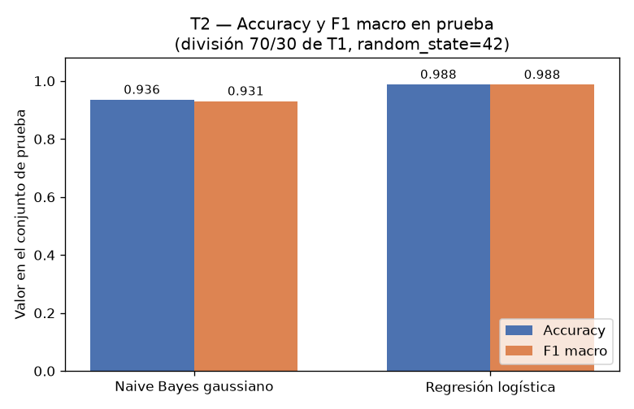
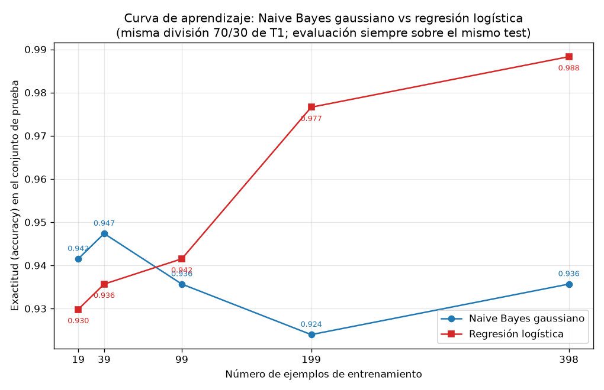

## Introducción

Ng y Jordan (2002) predijeron teóricamente que un clasificador generativo alcanza su error asintótico con menos ejemplos de entrenamiento que un discriminativo, aunque ese error asintótico sea peor. Esta tarea comprueba esa predicción sobre datos reales del conjunto Breast Cancer Wisconsin (Diagnostic), comparando un Naive Bayes gaussiano (generativo) contra una regresión logística (discriminativa) en una curva de aprendizaje sobre una única división train/test.

## Metodología

Se cargó `load_breast_cancer` de scikit-learn: 569 ejemplos, 30 atributos, con 212 casos malignant (proporción 0.3726) y 357 benign (0.6274). Los datos se dividieron una sola vez en 70 % entrenamiento y 30 % prueba, estratificando por clase y con `random_state=42`: 398 ejemplos de entrenamiento (148 malignant, 250 benign) y 171 de prueba (64 malignant, 107 benign). El conjunto de prueba no se usó para ajustar nada en ninguna parte de la tarea.

Se entrenaron dos modelos: un Naive Bayes gaussiano y una regresión logística. Para la regresión logística los atributos se estandarizaron con un `StandardScaler` ajustado únicamente con el entrenamiento; el mismo escalador transformó la prueba. (GaussianNB es invariante a transformaciones afines por atributo, así que se usó la misma matriz estandarizada para ambos.) Se midieron accuracy y F1 macro sobre el conjunto de prueba.

Para la curva de aprendizaje, sobre la misma división, se reentrenaron los dos modelos con submuestras estratificadas del 5 %, 10 %, 25 %, 50 % y 100 % del entrenamiento (`random_state=42`), lo que corresponde a 19, 39, 99, 199 y 398 ejemplos, y se evaluó cada modelo siempre sobre el mismo conjunto de prueba de 171 ejemplos.

## Resultados

**Parte 2 — Desempeño con el entrenamiento completo (398 ejemplos).** La tabla 1 muestra accuracy y F1 macro sobre el conjunto de prueba; la matriz de confusión del Naive Bayes fue [[57, 7], [4, 103]] y la de la regresión logística [[63, 1], [1, 106]].

Tabla 1. Métricas sobre el conjunto de prueba (n = 171).

| modelo | accuracy | f1_macro |
|---|---|---|
| Naive Bayes gaussiano | 0.9357 | 0.9307 |
| Regresión logística | 0.9883 | 0.9875 |

**Parte 3 — Curva de aprendizaje.** La tabla 2 y la figura 1 muestran la exactitud en prueba contra el número de ejemplos de entrenamiento.

Tabla 2. Exactitud en prueba por tamaño de entrenamiento.

| fracción | n_train | accuracy Naive Bayes gaussiano | accuracy Regresión logística |
|---|---|---|---|
| 5 % | 19 | 0.9415 | 0.9298 |
| 10 % | 39 | 0.9474 | 0.9357 |
| 25 % | 99 | 0.9357 | 0.9415 |
| 50 % | 199 | 0.9240 | 0.9766 |
| 100 % | 398 | 0.9357 | 0.9883 |

## Discusión

Los resultados reproducen el cruce que predicen Ng y Jordan. Con pocos ejemplos gana el generativo: con 19 ejemplos el Naive Bayes alcanza 0.9415 frente a 0.9298 de la regresión logística, y con 39 ejemplos 0.9474 frente a 0.9357. El cruce ocurre entre 39 y 99 ejemplos: con 99 la regresión logística ya supera al Naive Bayes (0.9415 contra 0.9357). A partir de ahí la ventaja discriminativa se amplía: con 199 ejemplos 0.9766 contra 0.9240, y con los 398 ejemplos completos 0.9883 contra 0.9357, consistente con la tabla de la Parte 2.

La forma de las dos curvas explica el cruce. La del Naive Bayes es casi plana: parte de 0.9415 con 19 ejemplos y termina en 0.9357 con 398, con una pequeña fluctuación en 199 (0.9240); es decir, converge muy rápido a su nivel asintótico, en torno a 0.93–0.94, y datos adicionales apenas lo mueven. La de la regresión logística crece de forma casi monótona: 0.9298, 0.9357, 0.9415, 0.9766 y 0.9883; necesita más datos para estabilizarse, pero su techo es claramente más alto.

Esta dinámica se entiende por sesgo y varianza. El Naive Bayes gaussiano impone un sesgo fuerte: asume que los 30 atributos son condicionalmente independientes dada la clase, algo falso en estos datos, donde mean radius, mean perimeter y mean area describen esencialmente la misma magnitud. Ese sesgo erróneo fija su error asintótico más alto. A cambio, el modelo estima pocos parámetros por clase (media y varianza de cada atributo) de forma separada, así que su varianza es baja y converge con pocas muestras: por eso ya con 19 ejemplos está cerca de su asíntota y supera a la regresión logística. La regresión logística tiene un sesgo más débil: solo asume una frontera de decisión lineal, sin imponer independencia, lo que le permite representar mejor la estructura real de los datos y lograr un error asintótico menor (0.9883 contra 0.9357). El costo es una varianza mayor con pocos datos: debe estimar 30 coeficientes conjuntamente, y con 19 ejemplos su exactitud (0.9298) es la peor de toda su curva. Conforme crece el entrenamiento, su varianza se reduce, el sesgo más bajo domina y supera al generativo, que ya está limitado por su supuesto de independencia.

En términos prácticos: con menos de unos 99 ejemplos conviene el Naive Bayes; con 99 o más, y de manera marcada desde 199, conviene la regresión logística.

## Conclusiones

Sobre Breast Cancer Wisconsin, con una única división 70/30 estratificada (`random_state=42`) y evaluación fija en 171 ejemplos de prueba, se observó el patrón de Ng y Jordan: el clasificador generativo (Naive Bayes gaussiano) es superior con pocos datos (0.9415 contra 0.9298 con 19 ejemplos; 0.9474 contra 0.9357 con 39) y converge rápido a un error asintótico mayor (0.9357 con 398 ejemplos), mientras que el discriminativo (regresión logística) arranca peor pero mejora de forma sostenida hasta 0.9883, con un cruce entre 39 y 99 ejemplos de entrenamiento. La explicación es el intercambio sesgo-varianza: el generativo compensa su sesgo alto (independencia condicional, incumplida aquí) con baja varianza; el discriminativo paga más varianza inicial por un sesgo menor y un mejor techo de desempeño.
