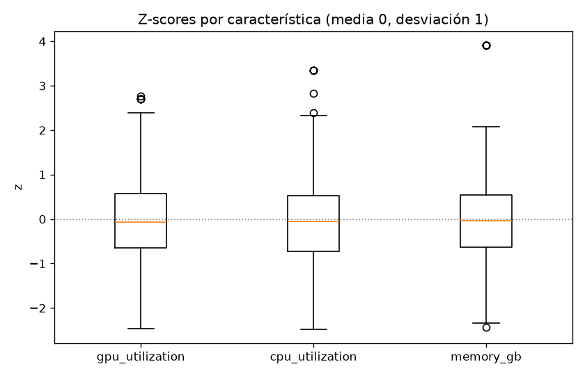
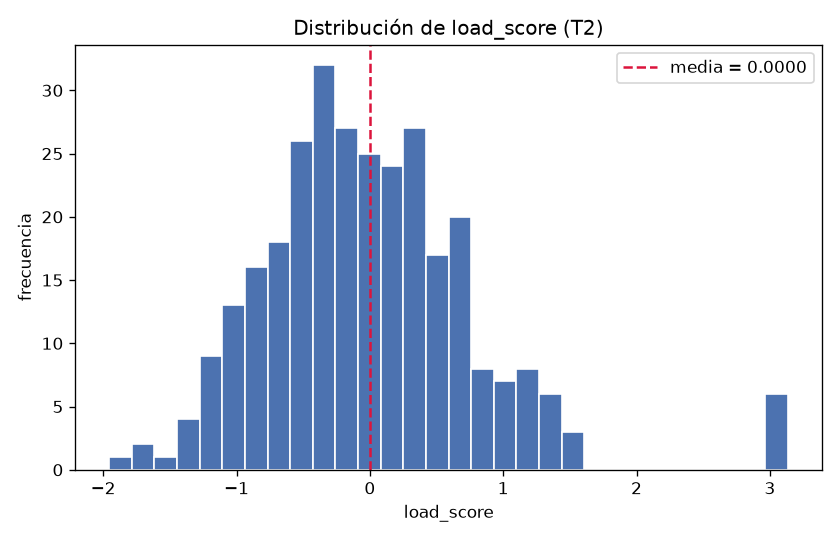
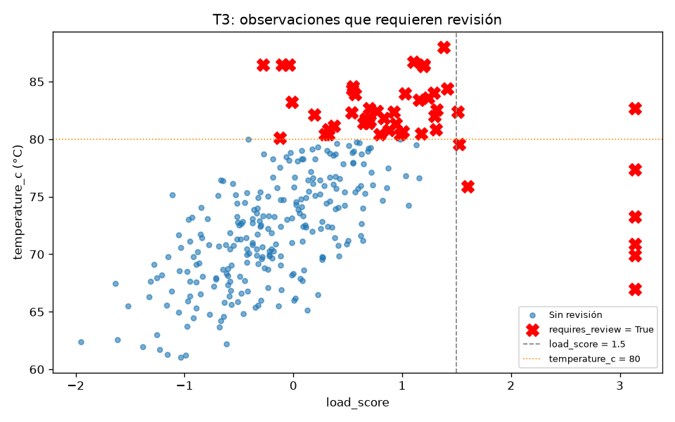
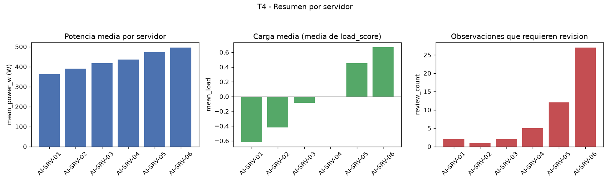

## Tarea 1

Se cargó `data/server_measurements.csv` con `parse_dates` en `timestamp` (parseo como fecha verificado): 300 filas y 7 columnas (server, timestamp, gpu_utilization, cpu_utilization, memory_gb, power_w, temperature_c). La clase `ServerMeasurements` almacena `values` como matriz NumPy bidimensional de tipo float64 y `feature_names` como tupla; las seis validaciones probadas lanzan `ValueError` correctamente: matriz 1D, matriz 3D, más nombres que columnas, más columnas que nombres, datos de texto y datos objeto no numéricos. `build_measurements(df)` selecciona las tres características en el orden exigido y las convierte a flotante. El repr obtenido coincide con el esperado:

```
ServerMeasurements(shape=(300, 3), features=('gpu_utilization', 'cpu_utilization', 'memory_gb'))
```

## Tarea 2

Sobre la matriz de la Tarea 1 se calcularon, de forma vectorizada, la media y la desviación estándar por columna:

| estadístico | gpu_utilization | cpu_utilization | memory_gb |
|---|---|---|---|
| media | 57.9931 | 50.5416 | 29.4553 |
| desviación estándar | 14.4301 | 12.6985 | 6.5368 |

Ninguna columna tuvo desviación estándar cero (0 columnas con std cero), de modo que la protección contra división por cero, aunque implementada, no llegó a activarse. El Z-score produjo `zscores` con forma (300, 3) y `load_score` con forma (300,), calculado como `zscores @ [0.50, 0.30, 0.20]` con los pesos (0.5, 0.3, 0.2), sin bucles sobre las observaciones.





## Tarea 3

Partiendo de una copia del DataFrame original (el original no se modifica) se agregaron `load_score` y `requires_review` (dtype bool) con la regla vectorizada `load_score > 1.5 o temperature_c > 80`; el DataFrame analizado queda con 9 columnas (las 7 originales más las 2 nuevas). De 300 observaciones, 49 requieren revisión (proporción 0.1633); el primer índice marcado es 23 y el load_score coincide exactamente con el de la Tarea 2 (diferencia máxima 0.0). La fila 23 citada en el enunciado es:

| server | timestamp | load_score | temperature_c | requires_review |
|---|---|---|---|---|
| AI-SRV-01 | 2026-08-24 09:55:00 | 3.136218 | 66.97 | True |



## Tarea 4

Agrupando por `server` se obtuvo la tabla resumen completa, con una fila por servidor y exactamente las columnas exigidas, en este orden:

| server | observations | mean_power_w | max_temperature_c | mean_load | review_count |
|---|---|---|---|---|---|
| AI-SRV-01 | 50 | 363.4598 | 86.50 | -0.614527 | 2 |
| AI-SRV-02 | 50 | 390.4990 | 76.47 | -0.417730 | 1 |
| AI-SRV-03 | 50 | 416.6088 | 86.50 | -0.085884 | 2 |
| AI-SRV-04 | 50 | 434.8684 | 80.86 | -0.003041 | 5 |
| AI-SRV-05 | 50 | 471.1808 | 86.50 | 0.453583 | 12 |
| AI-SRV-06 | 50 | 495.7276 | 88.01 | 0.667600 | 27 |

Los totales cuadran con la Tarea 3: 300 observaciones y 49 revisiones (49 == 49, con los índices coincidentes); la diferencia máxima entre el load_score reconstruido y el de la Tarea 3 fue 2.2204e-16. Los datos muestran un gradiente claro: mean_load sube de -0.614527 en AI-SRV-01 a 0.667600 en AI-SRV-06 y review_count crece de 2 a 27; AI-SRV-06 registra la temperatura máxima global (88.01) y AI-SRV-02 la más baja (76.47).



## Tarea 5

**La subtarea Tarea 5 no tiene resultado (fallida): no se reportan sus cifras.** La ejecución del guardado en `output/server_analysis.parquet` con PyArrow (sin índice) y de la posterior verificación del round trip no produjo resultados medidos, por lo que no es posible citar las cuatro verificaciones exigidas (filas antes == después, columnas antes == después, esquema antes == después y valores iguales). No se reporta ninguna cifra de esta sección para no inventar resultados; el guardado y su verificación quedan pendientes de una nueva ejecución del código.
