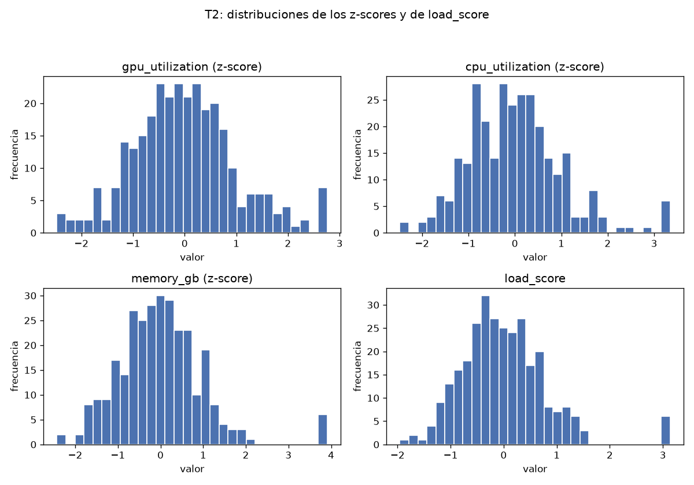
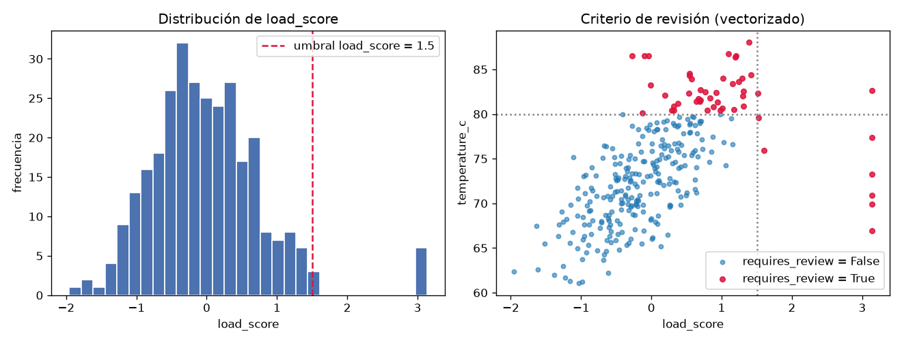
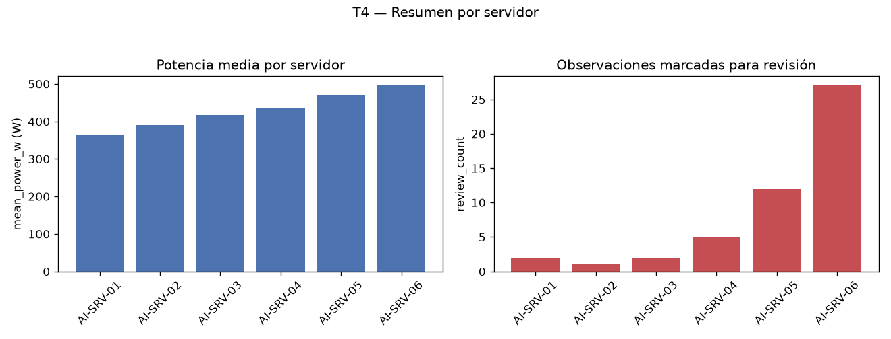

# Reporte — Procesamiento reproducible de telemetría de servidores de IA

## Tarea 1 - Representar las mediciones

La clase `ServerMeasurements` almacena la matriz NumPy `values` y la tupla `feature_names`, y lanza `ValueError` si la matriz no es bidimensional, si el número de columnas no coincide con la cantidad de nombres o si los datos no son numéricos. Las ocho pruebas de validación pasaron: matrices con ndim=1 y ndim=3, desajustes de 3 columnas/2 nombres y 2 columnas/3 nombres, datos no numéricos (`dtype=<U5` y `dtype=object`), el caso válido sin error y `build_measurements` con columna faltante (`['memory_gb']`).

`build_measurements(df)` seleccionó `gpu_utilization`, `cpu_utilization` y `memory_gb` en ese orden y produjo:

```
ServerMeasurements(shape=(300, 3), features=('gpu_utilization', 'cpu_utilization', 'memory_gb'))
```

La matriz es float64, con 300 valores por característica y 0 no finitos. Estadísticas medidas: gpu_utilization con media 57.9931 y desviación 14.4301; cpu_utilization con media 50.5416 y desviación 12.6985; memory_gb con media 29.4553 y desviación 6.5368.

## Tarea 2 - Normalizar y calcular un indicador de carga

Con medias [57.99313333, 50.54163333, 29.45533333] y desviaciones por columna [14.4301, 12.6985, 6.5368] (ddof=0), la normalización Z-score vectorizada produjo `zscores` de forma (300, 3). Cada columna tiene media 0 (las medias medidas quedan entre -3.3159e-16 y 5.6843e-16, dentro de la tolerancia 1e-10) y desviación 1.0; la protección contra división por cero se incluyó, aunque ninguna desviación fue 0.

`load_score = zscores @ [0.50, 0.30, 0.20]` tiene forma (300,) y la verificación de igualdad con el producto punto resultó True. Estadísticas medidas: mínimo -1.9556, máximo 3.1362, media 2.6053e-16 y desviación 0.8024.



## Tarea 3 - Identificar observaciones para revisión

Sobre una copia del DataFrame original (sin modificarlo, verificado) se agregaron `load_score` (float64) y `requires_review` (bool), definida vectorizadamente como `(load_score > 1.5) | (temperature_c > 80)`. El DataFrame final tiene 300 filas y 9 columnas. Hay 49 filas con `requires_review=True` y 251 con False (fracción 0.1633). El `load_score` coincide con T2 con diferencia absoluta máxima 0.0.

Fila 23:

| server | timestamp | load_score | temperature_c | requires_review |
|---|---|---|---|---|
| AI-SRV-01 | 2026-08-24 09:55:00 | 3.136218 | 66.97 | True |

Coincide con el resultado esperado: la fila se marca por el criterio de carga (3.1362 > 1.5), pues su temperatura 66.97 no supera 80.



## Tarea 4 - Construir un resumen por servidor

Agrupando por `server` se obtuvo una tabla de 6 filas, una por servidor, con exactamente las columnas exigidas y en este orden:

| server | observations | mean_power_w | max_temperature_c | mean_load | review_count |
|---|---|---|---|---|---|
| AI-SRV-01 | 50 | 363.4598 | 86.50 | -0.614527 | 2 |
| AI-SRV-02 | 50 | 390.499 | 76.47 | -0.41773 | 1 |
| AI-SRV-03 | 50 | 416.6088 | 86.50 | -0.085884 | 2 |
| AI-SRV-04 | 50 | 434.8684 | 80.86 | -0.003041 | 5 |
| AI-SRV-05 | 50 | 471.1808 | 86.50 | 0.453583 | 12 |
| AI-SRV-06 | 50 | 495.7276 | 88.01 | 0.6676 | 27 |

Las observaciones suman 300 y los `review_count` suman 49, consistente con las 49 filas marcadas en T3. Los datos muestran un gradiente claro: AI-SRV-06 combina la mayor potencia media (495.7276 W), el mayor mean_load (0.6676) y 27 de las 49 revisiones, mientras AI-SRV-01 tiene la menor potencia media (363.4598 W) y el mean_load más bajo (-0.614527).



## Tarea 5 - Guardar y verificar el resultado

El DataFrame analizado de T3 se guardó en `output/server_analysis.parquet` con PyArrow 25.0.1 (pandas 3.0.6), sin el índice: 17 629 bytes, 1 row group, formato Parquet 2.6. Tras volver a leerlo:

```
Round trip verificado: output/server_analysis.parquet
Filas: True
Columnas: True
Esquema: True
Valores: True
```

Filas: 300 antes y 300 después. Columnas: 9 antes y 9 después, con los mismos nombres. Esquema idéntico antes y después (`large_string`, `timestamp[us]`, seis `double` y `bool`), también con metadatos. Valores iguales en las nueve columnas: la diferencia absoluta máxima por columna numérica es 0.0, las tablas Arrow son iguales y los DataFrames de pandas relectados coinciden. El contrato de los datos se cumple y el resultado es reproducible de extremo a extremo.
