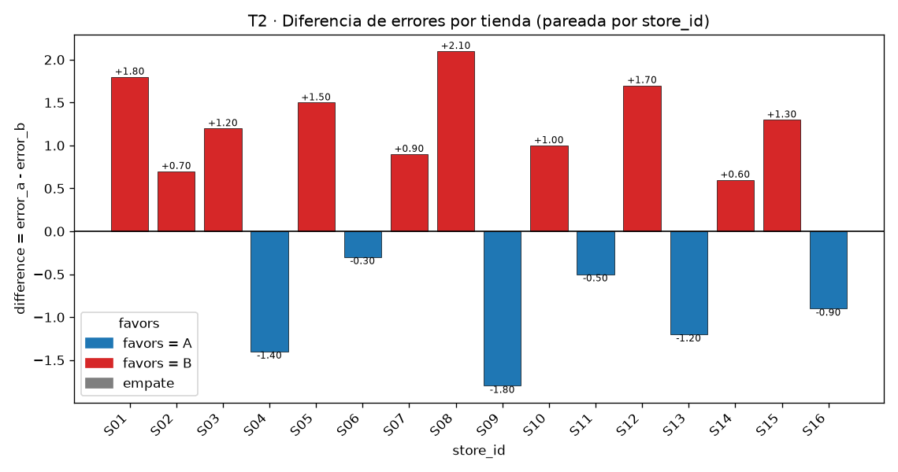
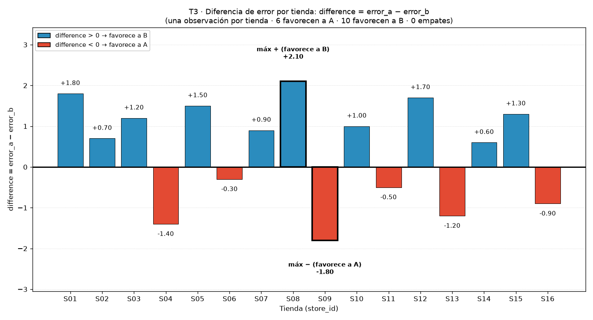
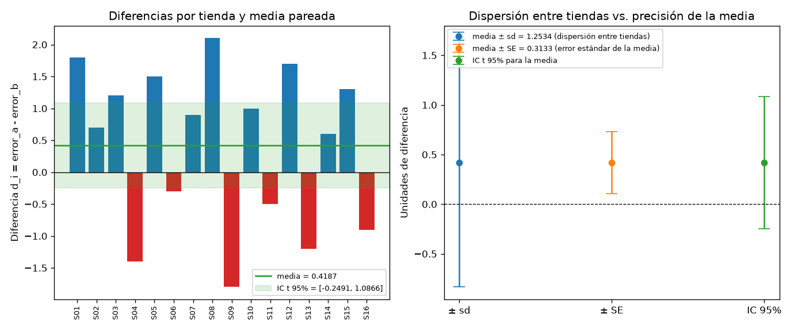
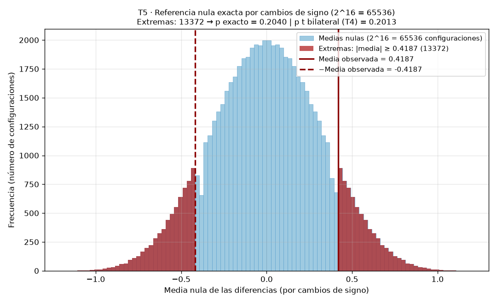

# Informe — Comparación defendible de dos modelos sobre tiendas pareadas

**Nota de entrega.** El presupuesto de tokens se agotó: se entrega lo que se alcanzó a medir. Las subtareas T6 (bootstrap pareado) y T7 (pipeline integrado en una sola corrida) quedaron sin resultado (pendientes); sus cifras no se reportan ni se sustituyen por valores inventados. Los artefactos `output/store_differences.csv` y `output/store_differences.png` provienen de las ejecuciones medidas de T2 y T3.

## Parte 1. Contrato de análisis previo

**1.** Se comparan dos modelos de regresión ya entrenados, A y B, que pronostican la demanda semanal de las mismas 16 tiendas (`store_id` S01–S16).

**2.** Proceso objetivo propuesto: el proceso generador de errores de pronóstico pareados cuando A y B predicen la demanda semanal en tiendas comparables; Δ se refiere a la media de las diferencias de ese proceso. Lo que impide afirmar que los datos representan realmente esa población es su procedencia: son sintéticos, deterministas y creados para la actividad, sin muestreo documentado de tiendas reales, por lo que no constituyen evidencia sobre una empresa, mercado o población existente.

**3.** Métrica principal: error absoluto del pronóstico semanal, en unidades vendidas; un valor menor es un mejor resultado. La dirección se define en la diferencia por tienda d_i = error_a - error_b.

**4.** Unidad de análisis: la tienda pareada; cada `store_id` aporta una observación (n = 16, confirmado en la auditoría de la Parte 2).

**5.** Las observaciones están emparejadas porque ambos modelos se evalúan sobre exactamente las mismas tiendas con la misma métrica: las condiciones de cada tienda afectan simultáneamente a sus dos errores. Verificaré los pares validando el CSV (columnas exactas, `store_id` único y no nulo) y construyendo la tabla mediante `store_id`, recalculando `difference` por tienda; comprobar solo longitudes iguales no demuestra la correspondencia.

**6.** Estimando: Δ = E(d_i), con d_i = e_A(i) - e_B(i). Una diferencia positiva significa que A comete más error absoluto que B en esa tienda, es decir, favorece a B; una negativa favorece a A.

**7.** H0: Δ = 0 frente a H1: Δ ≠ 0 (bilateral).

**8.** Procedimiento principal: prueba t de una muestra sobre el vector de diferencias (equivalente a la t pareada), alternativa bilateral. Supuestos: diferencias independientes entre tiendas y provenientes de una población aproximadamente normal (o n grande que apoye el p-value en el TCL), emparejamiento correcto por tienda y métrica continua.

**9.** Además del p-value se reportarán: n, media, desviación muestral y error estándar; estadístico t y grados de libertad; intervalo t del 95 %; la referencia exacta por cambios de signo (total de configuraciones, conteo de extremas y su p-value); el intervalo bootstrap percentil como sensibilidad; y la evidencia por tienda (figura y conteos de signo).

**10.** El diseño no permite afirmaciones causales, ni generalizar a tiendas, semanas o modelos no observados, ni usar los datos sintéticos como evidencia sobre poblaciones reales; la no significación no demuestra equivalencia (Δ = 0) y el p-value no es la probabilidad de que H0 sea verdadera.

## Parte 2. Auditoría y evidencia por tienda

**11.** Confirmado: la carga validó que el CSV tuviera exactamente las columnas `store_id`, `error_a`, `error_b`; que cada `store_id` fuera único y no nulo (con `ValueError` que menciona el identificador); y que los errores fueran numéricos, finitos y no negativos. Se verificaron 16 tiendas y el emparejamiento por `store_id`, recalculando `difference` por tienda; el CSV original quedó intacto (SHA-256 idéntico antes y después: cdd1af7ad3a6ee8f49a14f48ea2d8347591e85388a222b2a83b9d661ae95d7a2). La tabla pareada (16 filas, 5 columnas) se guardó en `output/store_differences.csv`. Comprobar únicamente que ambas columnas tienen la misma longitud no es suficiente: dos vectores de igual longitud pueden estar desalineados (otro orden o una fila intercambiada) y producir diferencias falsas; solo la clave `store_id` garantiza que cada `error_a` y `error_b` correspondan a la misma tienda.

| store_id | error_a | error_b | difference | favors |
|---|---|---|---|---|
| S01 | 12.4 | 10.6 | 1.8000 | B |
| S02 | 9.8 | 9.1 | 0.7000 | B |
| S03 | 15.1 | 13.9 | 1.2000 | B |
| S04 | 11.0 | 12.4 | -1.4000 | A |
| S05 | 8.7 | 7.2 | 1.5000 | B |
| S06 | 13.6 | 13.9 | -0.3000 | A |
| S07 | 10.2 | 9.3 | 0.9000 | B |
| S08 | 14.9 | 12.8 | 2.1000 | B |
| S09 | 7.5 | 9.3 | -1.8000 | A |
| S10 | 16.0 | 15.0 | 1.0000 | B |
| S11 | 9.3 | 9.8 | -0.5000 | A |
| S12 | 12.8 | 11.1 | 1.7000 | B |
| S13 | 11.7 | 12.9 | -1.2000 | A |
| S14 | 8.9 | 8.3 | 0.6000 | B |
| S15 | 13.2 | 11.9 | 1.3000 | B |
| S16 | 10.6 | 11.5 | -0.9000 | A |

**12.** Diez tiendas favorecen a B (S01, S02, S03, S05, S07, S08, S10, S12, S14, S15) y seis favorecen a A (S04, S06, S09, S11, S13, S16); no hay empates (0). Las mayores magnitudes son S08 con difference = 2.1000 (favorece a B) y S09 con difference = -1.8000 (favorece a A); en la figura, 10 barras quedan sobre la referencia en cero y 6 debajo.

## Parte 3. Efecto e incertidumbre

**13.** Con n = 16 tiendas, la diferencia media es 0.4187 unidades, la desviación estándar muestral es 1.2534 y el error estándar es 0.3133. El signo positivo indica que, en promedio, A comete 0.4187 unidades vendidas más de error absoluto que B: el efecto favorece a B. La DE (1.2534) mide la dispersión de las diferencias entre tiendas; el EE (0.3133) mide la precisión de la media muestral: son conceptos distintos y el EE resulta 4.0 veces menor que la DE al promediar 16 tiendas (EE = sd/√16).

| Cantidad | Valor |
|---|---|
| n (tiendas) | 16 |
| Media de las diferencias | 0.4187 |
| Desviación estándar muestral | 1.2534 |
| Error estándar (sd/√n) | 0.3133 |

**14.** Intervalo t bilateral del 95 %: [-0.2491, 1.0866], con gl = 15, t crítico = 2.1314 y margen de error = 0.6679 (verificado con scipy y con cálculo manual). Bajo el modelo utilizado (diferencias normales e independientes, n = 16), los valores del efecto compatibles con los datos van de -0.2491 unidades (leve ventaja de A) a 1.0866 unidades (ventaja de B); el intervalo contiene 0, coherente con no rechazar H0. No es una probabilidad posterior sobre el parámetro: en la interpretación frecuentista, el 95 % de los intervalos construidos con este procedimiento contendría al verdadero Δ; no afirma que P(Δ ∈ [-0.2491, 1.0866]) = 0.95.

## Parte 4. Referencias nulas y sensibilidad

**15.** Estadístico t = 1.3364 con 15 grados de libertad; p-value bilateral = 0.2013. Correctamente interpretado: condicional a la hipótesis nula (Δ = 0), al diseño pareado con n = 16 y a los supuestos de la prueba, el p-value es la probabilidad de obtener un estadístico t al menos tan extremo como 1.3364 en cualquier dirección. No es la probabilidad de que H0 sea verdadera. Con α = 0.05, p = 0.2013 > 0.05: no se rechaza H0; la conclusión no se reduce a "no significativo", pues el IC del 95 % muestra que efectos entre -0.2491 y 1.0866 unidades son compatibles con los datos.

**16.** Referencia exacta por cambios de signo: se enumeraron las 2^16 = 65536 configuraciones de signos; 13372 produjeron medias nulas con magnitud al menos tan extrema como la observada (0.4187), con 6686 configuraciones en cada cola (simetría exacta) y 896 con la magnitud exacta de la observada; p-value = 13372/65536 = 0.2040. La decisión coincide con la t (no rechazar H0) y los p-values quedan cerca (diferencia absoluta 0.0027; relativa 1.34 %), pero los procedimientos no son intercambiables: la t calibra con la distribución t de Student (gl = 15) y asume diferencias normales (o se apoya en el TCL), mientras que la referencia por cambios de signo no asume normalidad, solo que bajo H0 el signo de cada d_i es intercambiable, y calibra con la distribución finita y exacta de las 65536 medias nulas. Supuestos y distribuciones de referencia distintos implican procedimientos distintos; la cercanía numérica es empírica, no una identidad.

| Resultado | Valor |
|---|---|
| Configuraciones totales (2^16) | 65536 |
| Configuraciones extremas | 13372 |
| p-value exacto | 0.2040 (13372/65536) |
| p-value t (Parte 3) | 0.2013 |
| Diferencia absoluta | 0.0027 |

**17.** Sin resultado medido: la subtarea del bootstrap pareado (T6) quedó pendiente, por lo que el intervalo percentil del 95 % no se reporta en esta entrega y no se sustituye por ninguna cifra inventada. La configuración prevista por el enunciado era `np.random.default_rng` con semilla 20260829 y 10 000 remuestras, remuestreando tiendas completas mediante el vector de diferencias y exigiendo que dos ejecuciones con la misma semilla coincidan. Se remuestrean tiendas completas para preservar la estructura pareada y la dependencia entre los errores de A y B dentro de cada tienda; remuestrearlos por separado rompería los pares y destruiría la correlación que motiva el diseño pareado. El bootstrap no corrige automáticamente muestras no representativas o sesgadas, ni dependencias entre tiendas, ni la escasa información de n = 16: hereda las limitaciones de la muestra observada.

## Parte 5. Informe ejecutivo

**18.** Unidad: 16 tiendas pareadas por store_id. Procedencia: datos sintéticos y deterministas; no evidencian nada sobre tiendas reales. Métrica: error absoluto del pronóstico semanal (menor es mejor). Emparejamiento: ambos modelos evaluados en las mismas tiendas, verificado por store_id. Efecto: media de d_i = error_a - error_b igual a 0.4187 unidades, favorable a B; DE muestral 1.2534; EE 0.3133. Procedimiento: prueba t de una muestra bilateral: t = 1.3364, gl = 15, p = 0.2013; IC t del 95%: [-0.2491, 1.0866]. Sensibilidad: referencia exacta por cambios de signo, p = 0.2040 (13372/65536); el bootstrap (semilla 20260829, 10 000 remuestras) quedó pendiente y no se reporta. Limitaciones: n = 16 pequeño y datos sintéticos sin correspondencia con población real alguna. No puede concluirse que B supere a A fuera de estas 16 tiendas sintéticas, ni que la diferencia sea exactamente cero.
