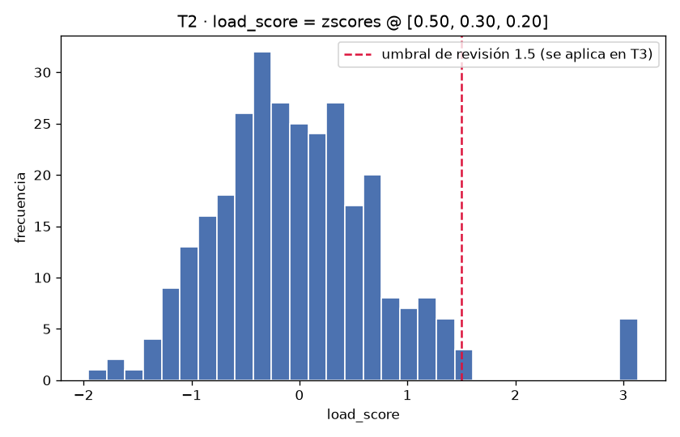
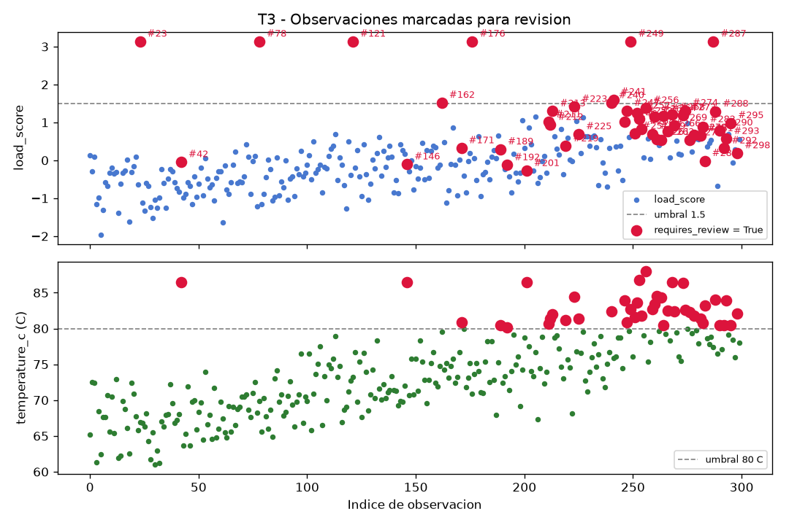

## Tarea 1 - Representar las mediciones

La clase `ServerMeasurements` almacena `values` (matriz NumPy 2D) y `feature_names` (tupla), y lanza `ValueError` en los tres casos exigidos: matriz no bidimensional, número de columnas distinto de la cantidad de nombres y datos no numéricos; las tres pruebas de validación pasaron. `build_measurements(df)` selecciona `gpu_utilization`, `cpu_utilization` y `memory_gb` en ese orden y las convierte a matriz flotante. El `repr` obtenido coincide con el esperado:

```
ServerMeasurements(shape=(300, 3), features=('gpu_utilization', 'cpu_utilization', 'memory_gb'))
```

La matriz tiene forma (300, 3) y dtype `float64`; el CSV se leyó con `parse_dates`, quedando `timestamp` como `datetime64[us]`. Primera fila de valores: 59.61, 59.61, 24.87.

## Tarea 2 - Normalizar y calcular un indicador de carga

Medias por columna: [57.9931, 50.5416, 29.4553]. Desviaciones estándar (ddof=0): [14.4301, 12.6985, 6.5368]; ninguna es cero, aunque el cálculo contempla la división por cero. La normalización Z-score se hizo vectorizada, sin bucles sobre observaciones: `zscores.shape = (300, 3)`. El indicador se construyó como `load_score = zscores @ [0.50, 0.30, 0.20]`, con forma (300,). Su media es 2.6053e-16 (prácticamente 0), con mínimo -1.9556 y máximo 3.1362.



## Tarea 3 - Identificar observaciones para revisión

Se creó una copia del DataFrame original (300 filas, 7 columnas), sin modificarlo, y se agregaron `load_score` (`float64`) y `requires_review` (`bool`), para 9 columnas en total. La regla aplicada: `load_score > 1.5` o `temperature_c > 80`. Resultados: 9 observaciones superan el umbral de carga, 42 superan los 80 °C y 49 filas requieren revisión (dos cumplen ambas condiciones). La fila con mayor `load_score` es la 23:

| | server | timestamp | load_score | temperature_c | requires_review |
|---|---|---|---|---|---|
| 23 | AI-SRV-01 | 2026-08-24 09:55:00 | 3.1362 | 66.97 | True |



## Tarea 4 - Construir un resumen por servidor

Agrupando por `server` se obtuvo la tabla con las columnas exigidas, en orden, y una fila por servidor (50 observaciones cada uno, 300 en total):

| server | observations | mean_power_w | max_temperature_c | mean_load | review_count |
|---|---|---|---|---|---|
| AI-SRV-01 | 50 | 363.4598 | 86.50 | -0.6145 | 2 |
| AI-SRV-02 | 50 | 390.4990 | 76.47 | -0.4177 | 1 |
| AI-SRV-03 | 50 | 416.6088 | 86.50 | -0.0859 | 2 |
| AI-SRV-04 | 50 | 434.8684 | 80.86 | -0.0030 | 5 |
| AI-SRV-05 | 50 | 471.1808 | 86.50 | 0.4536 | 12 |
| AI-SRV-06 | 50 | 495.7276 | 88.01 | 0.6676 | 27 |

La suma de `review_count` (49) coincide con las 49 filas marcadas en la Tarea 3. AI-SRV-06 concentra la mayor carga media (0.6676) y 27 revisiones, mientras AI-SRV-01 tiene la carga media más baja (-0.6145); el patrón de `mean_load` crece junto con `mean_power_w` de 363.4598 a 495.7276 W.

## Tarea 5 - Guardar y verificar el resultado

El DataFrame analizado de la Tarea 3 se guardó en `output/server_analysis.parquet` con PyArrow y sin índice (17 629 bytes). Tras volver a leerlo, las cuatro verificaciones del round trip:

- Filas: True (300 antes == 300 después)
- Columnas: True (9 antes == 9 después)
- Esquema: True (`server: large_string`, `timestamp: timestamp[us]`, cinco columnas `double` y `requires_review: bool`, idéntico antes y después)
- Valores: True

Round trip verificado: `output/server_analysis.parquet`. El archivo conserva las 49 marcas de revisión y el rango de `load_score` (-1.9556 a 3.1362), confirmando que la persistencia en Parquet no alteró los datos del pipeline.
