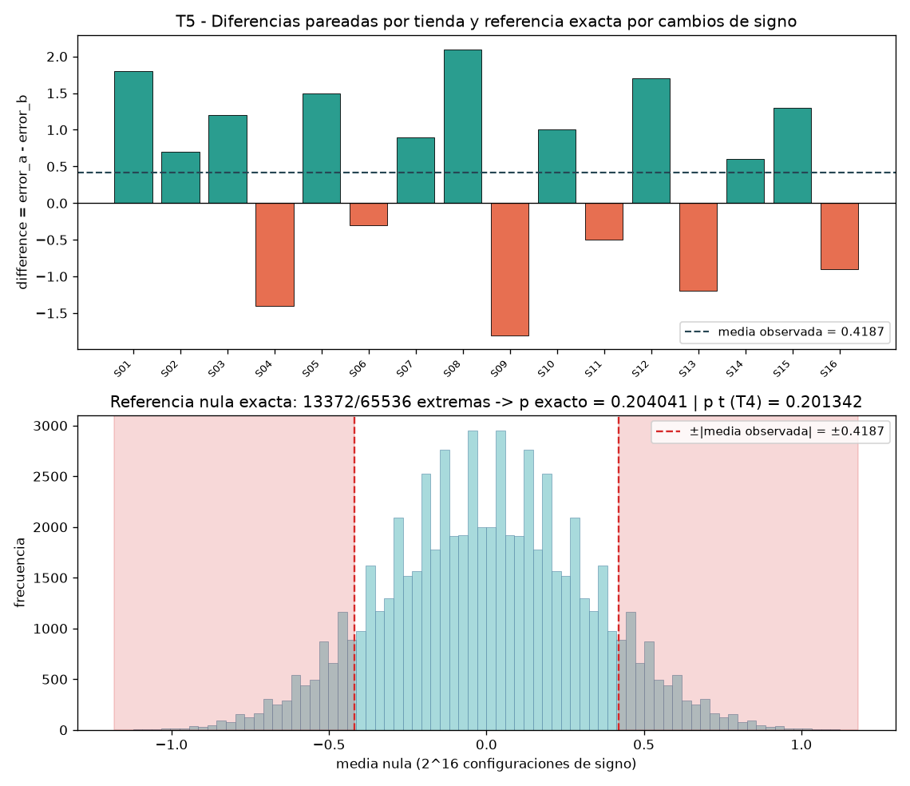
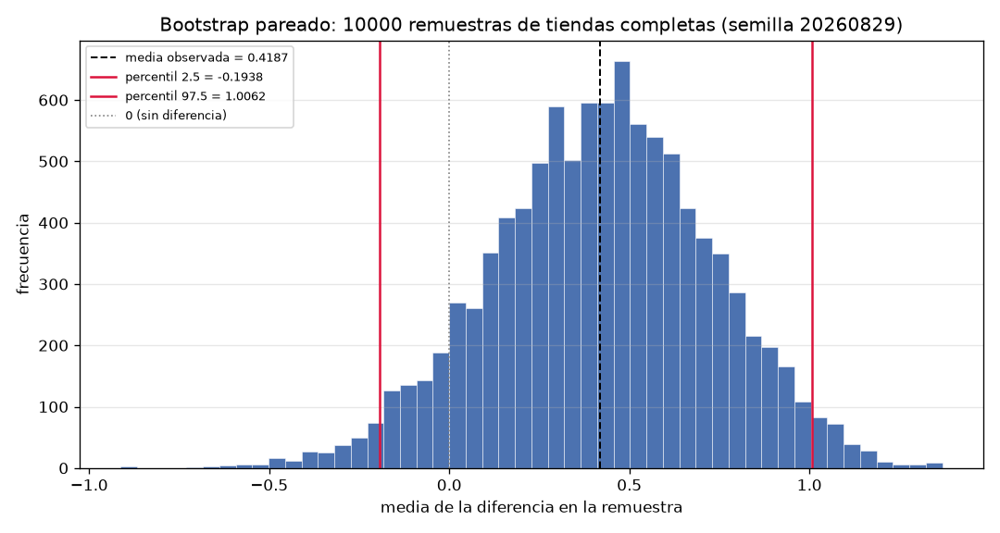

# Informe — Comparación defendible de dos modelos sobre tiendas pareadas

> **Nota de entrega.** La subtarea T7 (Tarea 7: ejecución integrada del pipeline en una sola corrida) no tiene resultado (pendiente): no se reportan sus cifras. El presupuesto de tokens se agotó: se entrega lo que se alcanzó a medir. Las respuestas siguientes se apoyan en los resultados medidos de las Tareas 2–6 (auditoría y pares, figura por tienda, efecto e incertidumbre, referencia exacta por cambios de signo y bootstrap pareado).

## Parte 1. Contrato de análisis previo

**1. ¿Qué dos modelos se comparan?**

Se comparan dos modelos de regresión ya entrenados, A y B, que pronostican la demanda semanal de las mismas 16 tiendas. Los datos de entrada son sus errores absolutos por tienda (columnas `error_a` y `error_b` de `data/model_errors.csv`).

**2. ¿Qué población o proceso objetivo propone para interpretar el ejercicio? Aclare qué impide afirmar que los datos sintéticos representan realmente esa población.**

Propongo como proceso objetivo el proceso que genera errores absolutos de pronóstico en tiendas pareadas evaluadas sobre el mismo periodo: una población de pares (error_A, error_B) de la que las 16 tiendas del archivo son una muestra, y sobre la cual el estimando de interés es la media de las diferencias pareadas. Lo que impide afirmar que los datos representan realmente esa población es su procedencia: son sintéticos, deterministas y creados para esta actividad; no provienen de tiendas reales y no constituyen evidencia sobre una empresa, mercado o población existente, de modo que cualquier generalización a tiendas o mercados reales queda fuera de lo que el diseño respalda.

**3. ¿Cuál es la métrica principal y qué dirección representa un mejor resultado?**

La métrica principal es el error absoluto de pronóstico, medido en unidades vendidas; un valor menor representa un mejor pronóstico. La comparación se resume en la diferencia por tienda d_i = error_a - error_b, expresada en las mismas unidades.

**4. ¿Cuál es la unidad de análisis?**

La tienda pareada: cada una de las 16 tiendas aporta un par (error_a, error_b) y una diferencia d_i. El tamaño muestral del diseño es n = 16 pares, verificado después por la auditoría (16 pares validados y 16 tiendas únicas).

**5. ¿Por qué las observaciones están emparejadas y cómo verificará los pares?**

Están emparejadas porque ambos modelos se evalúan sobre las mismas unidades: los errores de A y de B de una misma fila pertenecen al mismo store_id, y el pareado permite que cada tienda actúe como su propio control, cancelando la heterogeneidad entre tiendas. Verificaré los pares mediante store_id: identificadores únicos y no nulos, con ambos errores en la misma fila. Comprobar únicamente que los dos vectores tienen la misma longitud no demuestra que correspondan a las mismas tiendas: un orden distinto o un identificador desalineado emparejaría errores de tiendas diferentes y contaminaría todas las diferencias sin generar aviso alguno.

**6. Defina el estimando y la diferencia por tienda. Explique qué significa una diferencia positiva.**

El estimando es Δ = E(d_i), la media poblacional de las diferencias pareadas, con d_i = e_A(i) - e_B(i) en cada tienda. Una diferencia positiva significa que el error absoluto de A excede al de B en esa tienda, es decir, la diferencia favorece a B; una diferencia negativa favorece a A, y una diferencia exactamente cero sería un empate.

**7. Escriba la hipótesis nula y la alternativa bilateral.**

H0: Δ = 0 (la media de las diferencias pareadas es nula) frente a H1: Δ ≠ 0 (alternativa bilateral).

**8. ¿Cuál será el procedimiento principal y qué supuestos requiere?**

El procedimiento principal es una prueba t de una muestra sobre el vector de diferencias, con alternativa bilateral (`scipy.stats.ttest_1samp`, popmean = 0). Requiere: independencia de las diferencias entre tiendas (diseño de tiendas pareadas independientes), que la media de las diferencias sea aproximadamente normal bajo el modelo t (diferencias aproximadamente normales o muestra suficientemente grande), medición en escala de intervalo y un pareado verificado por store_id.

**9. ¿Qué resultados reportará además del p-value?**

El efecto (media de las diferencias), la desviación estándar muestral y el error estándar; el estadístico t y sus grados de libertad; el intervalo t bilateral del 95 %; la figura por tienda con el signo y la magnitud de las diferencias y la referencia en cero; la referencia exacta por cambios de signo (total de configuraciones, conteo de configuraciones extremas y su p-value); y el intervalo bootstrap percentil del 95 % con su semilla y número de remuestras.

**10. ¿Qué afirmaciones no permite realizar este diseño?**

No permite afirmar representatividad sobre tiendas, empresas, mercados o poblaciones reales (los datos son sintéticos y deterministas); establecer relaciones causales; extrapolar a otras tiendas, semanas, modelos o métricas; interpretar el p-value como la probabilidad de que la hipótesis nula sea verdadera; ni concluir que "no existe diferencia" a partir de no rechazar H0, pues la ausencia de rechazo no es evidencia de equivalencia.

## Parte 2. Auditoría y evidencia por tienda

**11. Confirme que los 16 pares fueron validados mediante store_id. Explique por qué comprobar únicamente que ambas columnas tienen la misma longitud no es suficiente.**

Confirmado: la auditoría validó 16 pares mediante store_id, con 16 tiendas únicas. Se verificó que el archivo contiene exactamente las columnas store_id, error_a y error_b; que los identificadores son únicos y no nulos; que los errores son numéricos, finitos y no negativos; y que cada par (error_a, error_b) comparte la misma fila del mismo store_id. Las pruebas internas confirmaron que se lanza ValueError ante columnas incorrectas o faltantes, store_id duplicado o nulo, y errores no numéricos, no finitos o negativos; el CSV original no fue modificado. Comprobar solo la longitud no es suficiente porque la igualdad de longitudes (16 y 16) no garantiza la correspondencia fila a fila: si las filas estuvieran en otro orden o un identificador estuviera desplazado, se emparejarían errores de tiendas distintas y las diferencias —y con ellas el efecto, la prueba t y toda la conclusión— quedarían contaminadas sin ningún aviso.

**12. Indique cuántas tiendas favorecen a A, cuántas favorecen a B y si existen empates. Identifique las diferencias de mayor magnitud en cada dirección.**

De las 16 tiendas, 10 favorecen a B (S01, S02, S03, S05, S07, S08, S10, S12, S14 y S15) y 6 favorecen a A (S04, S06, S09, S11, S13 y S16); no hay empates (0 diferencias exactamente nulas). La diferencia de mayor magnitud a favor de B es la de S08, con difference = 2.1 (error_a = 14.9 frente a error_b = 12.8), y la de mayor magnitud a favor de A es la de S09, con difference = -1.8 (error_a = 7.5 frente a error_b = 9.3). La tabla pareada se guardó en `output/store_differences.csv` (columnas store_id, error_a, error_b, difference, favors) y la figura en `output/store_differences.png`; en la figura se aprecia una barra por tienda con su signo y magnitud, la línea de referencia en cero, el predominio de barras positivas (a favor de B) y que la barra de mayor valor absoluto es la de S08.

| store_id | error_a | error_b | difference | favors |
|---|---|---|---|---|
| S01 | 12.4 | 10.6 | 1.8 | B |
| S02 | 9.8 | 9.1 | 0.7 | B |
| S03 | 15.1 | 13.9 | 1.2 | B |
| S04 | 11.0 | 12.4 | -1.4 | A |
| S05 | 8.7 | 7.2 | 1.5 | B |
| S06 | 13.6 | 13.9 | -0.3 | A |
| S07 | 10.2 | 9.3 | 0.9 | B |
| S08 | 14.9 | 12.8 | 2.1 | B |
| S09 | 7.5 | 9.3 | -1.8 | A |
| S10 | 16.0 | 15.0 | 1.0 | B |
| S11 | 9.3 | 9.8 | -0.5 | A |
| S12 | 12.8 | 11.1 | 1.7 | B |
| S13 | 11.7 | 12.9 | -1.2 | A |
| S14 | 8.9 | 8.3 | 0.6 | B |
| S15 | 13.2 | 11.9 | 1.3 | B |
| S16 | 10.6 | 11.5 | -0.9 | A |

## Parte 3. Efecto e incertidumbre

**13. Reporte el número de tiendas, la diferencia media, la desviación estándar muestral y el error estándar. Interprete el signo y la magnitud de la diferencia media en unidades vendidas.**

Con n = 16 tiendas: diferencia media = 0.4187 unidades vendidas; desviación estándar muestral (ddof = 1) = 1.2534; error estándar = 0.3133 (SE = sd/√n = 1.2534/4). El signo positivo indica que, en promedio, el error absoluto de A excede al de B en 0.4187 unidades vendidas: el efecto puntual favorece a B, con una magnitud modesta frente a la dispersión entre tiendas. La desviación estándar (1.2534) describe cuánto varía la diferencia de una tienda a otra; el error estándar (0.3133) es la incertidumbre de la media pareada y disminuye con √n. Son cantidades distintas: la primera describe la dispersión de los datos, la segunda la precisión de la media.

**14. Reporte el intervalo t del 95 %. Explique qué valores del efecto son compatibles con los datos bajo el modelo utilizado. No interprete el intervalo como una probabilidad posterior sobre el parámetro.**

El intervalo t bilateral del 95 % para la media pareada es [-0.2491, 1.0866] unidades vendidas (t crítico = 2.1314 con 15 grados de libertad; semiancho = 0.6679). Bajo el modelo t utilizado, los valores del efecto compatibles con los datos van desde -0.2491 (leve ventaja de A) hasta 1.0866 (ventaja de B de más de una unidad vendida); el intervalo contiene 0, por lo que un efecto nulo también es compatible con los datos. El intervalo es un rango de valores del parámetro consistentes con los datos y los supuestos del modelo; no es una probabilidad posterior sobre Δ: no afirma que exista un 95 % de probabilidad de que el verdadero Δ esté dentro de él.

## Parte 4. Referencias nulas y sensibilidad

**15. Reporte el estadístico t, sus grados de libertad y el p-value bilateral. Explique correctamente qué representa ese p-value.**

La prueba t de una muestra sobre las diferencias (popmean = 0, alternativa bilateral) produce estadístico t = 1.3364 con 15 grados de libertad y p-value = 0.2013. El p-value se interpreta de forma condicional a la hipótesis nula: si H0 fuera cierta (Δ = 0) y se repitiera el mismo diseño —16 tiendas pareadas, misma métrica y los supuestos del procedimiento t—, la probabilidad de observar un estadístico t con magnitud al menos tan extrema como 1.3364 sería 0.2013. No es la probabilidad de que H0 sea verdadera ni la de que el efecto sea cero. Con p = 0.2013 ≥ 0.05 no se rechaza H0 al nivel del 5 %, en coherencia con el intervalo t del 95 % que contiene 0.

**16. Reporte el p-value de la prueba exacta por cambios de signo. Explique por qué esta referencia nula y la prueba t no tienen supuestos idénticos.**

La referencia exacta enumeró exhaustivamente las 2^16 = 65536 configuraciones de signos de las 16 diferencias; 13372 produjeron medias nulas con magnitud al menos tan extrema como la observada (criterio |media nula| ≥ 0.4187, empates incluidos: 12476 estrictamente más extremas y 896 empatadas), lo que da un p-value exacto = 0.2040 (13372/65536). Una verificación independiente por conteo exacto de subconjuntos reprodujo el mismo conteo. Los dos p-values están cerca (0.2040 frente a 0.2013; diferencia absoluta 0.0027) y coinciden en la decisión al 5 % (no rechazar H0), pero los procedimientos no son intercambiables: la prueba t compara la media con una referencia continua de Student y supone diferencias aproximadamente normales (o muestra grande), con la varianza estimada de los datos; la prueba por cambios de signo no supone normalidad —su referencia nula es discreta (las 65536 medias) y se construye reasignando signos a las diferencias observadas bajo simetría de los signos—. Con datos asimétricos, atípicos o muestras pequeñas podrían divergir; aquí la aproximación t es buena con n = 16 y diferencias razonablemente simétricas.

**17. Reporte el intervalo bootstrap pareado, la semilla y el número de remuestras. Explique por qué se remuestrean tiendas completas y qué problema no puede corregir automáticamente el bootstrap.**

El bootstrap pareado usó la semilla 20260829 y 10000 remuestras con `np.random.default_rng`; el intervalo percentil del 95 % es [-0.1938, 1.0062] unidades vendidas (media de las medias bootstrap = 0.4210, desviación = 0.3056, sesgo aproximado = 0.0022; 9119 remuestras con media positiva, proporción 0.9119, y 881 con media negativa, 0.0881). El intervalo contiene 0, y dos ejecuciones con la misma semilla produjeron exactamente el mismo intervalo, lo que confirma la reproducibilidad. Se remuestrean tiendas completas —el par (error_a, error_b) con su difference— porque la unidad de análisis es la tienda pareada: remuestrear por separado los errores de A y de B rompería el emparejamiento y destruiría la correlación dentro de tienda que el diseño explota. El bootstrap no puede corregir automáticamente los defectos de la muestra original —sesgo de selección, errores de medición o un emparejamiento incorrecto—: remuestrea los datos tal como son, sin introducir información nueva, y con n = 16 hereda la granularidad de las 16 diferencias observadas.

**Síntesis de las tres referencias:**

| Procedimiento | Estadístico / intervalo | p-value | Decisión al 5 % |
|---|---|---|---|
| Prueba t de una muestra (bilateral) | t = 1.3364, gl = 15; IC t 95 % = [-0.2491, 1.0866] | 0.2013 | No rechazar H0 |
| Exacta por cambios de signo | 13372 configuraciones extremas de 65536 | 0.2040 | No rechazar H0 |
| Bootstrap percentil pareado (sensibilidad) | IC 95 % = [-0.1938, 1.0062] (semilla 20260829, 10000 remuestras) | — | Intervalo compatible con 0 |

## Parte 5. Informe ejecutivo

**18. Redacte un máximo de 150 palabras que incluya unidad, procedencia, métrica, emparejamiento, efecto, incertidumbre, procedimiento, p-value, análisis de sensibilidad, al menos dos limitaciones y una afirmación explícita sobre lo que no puede concluirse.**

Unidad: 16 tiendas pareadas. Procedencia: datos sintéticos y deterministas; no representan tiendas reales. Métrica: error absoluto en unidades vendidas (menor es mejor), con medición emparejada por store_id entre los modelos A y B. Efecto: diferencia media (A-B) de 0.4187 unidades a favor de B, con desviación muestral 1.2534 y error estándar 0.3133. Procedimiento: prueba t de una muestra bilateral sobre las diferencias; t = 1.3364 con 15 grados de libertad y p = 0.2013; intervalo t del 95 %: [-0.2491, 1.0866]. Sensibilidad: prueba exacta por cambios de signo con 65536 configuraciones (p = 0.2040) y bootstrap pareado percentil (semilla 20260829, 10000 remuestras) con intervalo [-0.1938, 1.0062]; ambos contienen cero. Limitaciones: muestra pequeña y sintética; supuestos del modelo t (aproximación normal, independencia). No puede concluirse que B supere a A, que no exista diferencia ni que los resultados se generalicen a tiendas reales.
