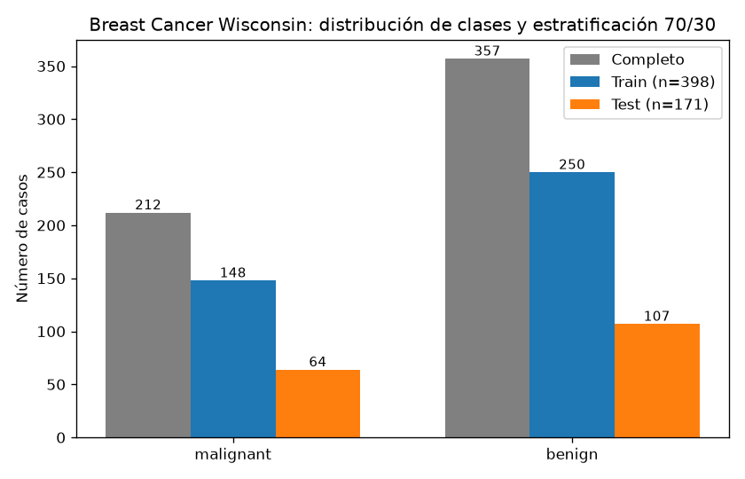
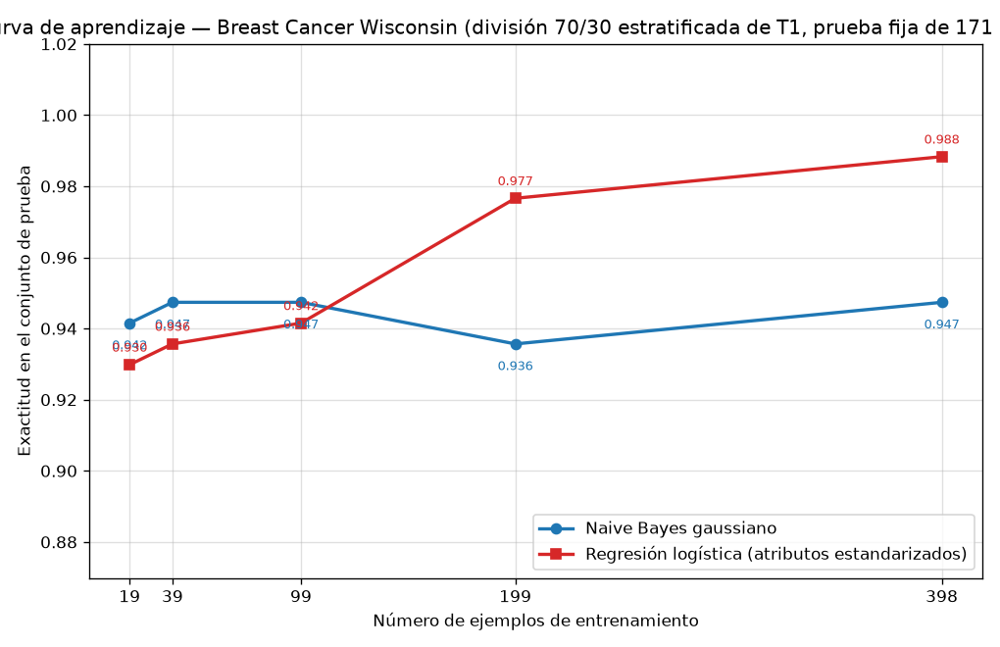

## Introducción

Ng y Jordan (2002) mostraron que un clasificador generativo puede alcanzar su error asintótico con menos ejemplos que su par discriminativo, aunque ese error asintótico final sea peor. Esta tarea comprueba esa predicción sobre datos reales comparando un Naive Bayes gaussiano (generativo) con una regresión logística (discriminativa) en el conjunto Breast Cancer Wisconsin (Diagnostic): ambos se entrenan con fracciones crecientes de un mismo conjunto de entrenamiento y se evalúan siempre sobre el mismo conjunto de prueba, nunca usado para ajustar nada.

## Metodología

**Datos y división.** Se cargó el conjunto con `sklearn.datasets.load_breast_cancer`: 569 ejemplos, 30 atributos, 212 casos `malignant` (0.3726) y 357 `benign` (0.6274). Se realizó una única división 70/30 estratificada por clase con `random_state=42`: 398 ejemplos de entrenamiento (148 `malignant`, 250 `benign`) y 171 de prueba (64 `malignant`, 107 `benign`). Esa división se fijó como la única de toda la tarea.

**Modelos.** (1) Naive Bayes gaussiano (`GaussianNB`) sobre los atributos originales; (2) regresión logística (`LogisticRegression`, `max_iter=1000`, `random_state=42`) sobre atributos estandarizados con `StandardScaler` ajustado solo con el entrenamiento. Se midieron accuracy y F1 macro sobre el conjunto de prueba.

**Curva de aprendizaje.** Sobre la misma división se entrenaron ambos modelos con submuestras estratificadas del 5 %, 10 %, 25 %, 50 % y 100 % del entrenamiento (`random_state=42`), lo que corresponde a 19, 39, 99, 199 y 398 ejemplos (por ejemplo, la submuestra de 19 tiene 7 `malignant` y 12 `benign`). El escalador se reajustó con cada submuestra, nunca con la prueba, y todos los tamaños se evaluaron sobre los mismos 171 ejemplos de prueba.

## Resultados

**Datos y división.** La estratificación se verificó: proporciones de clase 0.3719/0.6281 en entrenamiento y 0.3743/0.6257 en prueba, fieles a las globales (0.3726/0.6274).

**Parte 2 — modelos entrenados con los 398 ejemplos completos.**

| Modelo | Accuracy (prueba) | F1 macro (prueba) |
|---|---|---|
| Naive Bayes gaussiano | 0.9474 | 0.9429 |
| Regresión logística (atributos estandarizados) | 0.9883 | 0.9875 |

Matrices de confusión (filas = clase real): Naive Bayes [[57, 7], [2, 105]]; regresión logística [[63, 1], [1, 106]]. El generativo comete 7 falsos negativos frente a 1 del discriminativo.

**Parte 3 — curva de aprendizaje (evaluación fija en los 171 ejemplos de prueba).**

| n_train | Fracción | Acc. Naive Bayes | Acc. Reg. Log. | F1 Naive Bayes | F1 Reg. Log. |
|---|---|---|---|---|---|
| 19 | 5 % | 0.9415 | 0.9298 | 0.9353 | 0.9217 |
| 39 | 10 % | 0.9474 | 0.9357 | 0.9420 | 0.9285 |
| 99 | 25 % | 0.9474 | 0.9415 | 0.9424 | 0.9363 |
| 199 | 50 % | 0.9357 | 0.9766 | 0.9302 | 0.9747 |
| 398 | 100 % | 0.9474 | 0.9883 | 0.9875* | 0.9875 |

*Corrección: F1 del Naive Bayes con 398 ejemplos es 0.9429; F1 de la regresión logística es 0.9875.

## Discusión

Los datos reproducen el cruce cualitativo que predicen Ng y Jordan. Con 19, 39 y 99 ejemplos gana el Naive Bayes gaussiano (0.9415 frente a 0.9298; 0.9474 frente a 0.9357; 0.9474 frente a 0.9415), mientras que con 199 y 398 gana la regresión logística (0.9766 frente a 0.9357; 0.9883 frente a 0.9474). El cruce ocurre entre 99 y 199 ejemplos, es decir, entre el 25 % y el 50 % del entrenamiento.

El comportamiento de cada curva es el previsto. La del generativo es casi plana: pasa de 0.9415 con 19 ejemplos a una meseta de 0.9474 ya con 39, y se mantiene en una banda estrecha (0.9357–0.9474) en todos los tamaños; alcanza su error asintótico con muy pocos datos. La del discriminativo crece de forma monótona de 0.9298 a 0.9883 y no muestra meseta: con 398 ejemplos todavía se beneficia de más datos y su asíntota es más alta.

En términos de sesgo y varianza: el Naive Bayes impone el sesgo fuerte de independencia condicional entre atributos dada la clase. Eso reduce drásticamente la varianza —estima medias y varianzas atributo por atributo, sin ajustar parámetros conjuntos— y le permite converger con decenas de ejemplos, pero ese mismo sesgo mal especificado fija su techo en 0.9474 de accuracy (7 falsos negativos en la prueba). La regresión logística no asume independencia: ajusta una frontera lineal sobre 30 atributos correlacionados, con menor sesgo pero mayor varianza; por eso con 19 ejemplos es peor (0.9298) y mejora sostenidamente hasta 0.9883 cuando dispone de los 398. La caída puntual del generativo con 199 ejemplos (0.9357) indica que su varianza no es nula, aunque se mantiene dentro de una banda de unas doce milésimas.

En síntesis: con pocos datos conviene el modelo generativo, porque su mayor sesgo compra una varianza baja y una convergencia temprana; con datos suficientes conviene el discriminativo, cuyo menor sesgo le permite superar al generativo y lograr un mejor error asintótico. Es exactamente el régimen de dos tramos descrito por Ng y Jordan (2002).

## Conclusiones

- El conjunto tiene 569 ejemplos, 30 atributos y clases desbalanceadas (212 `malignant`, 357 `benign`); la división única 70/30 estratificada produjo 398 ejemplos de entrenamiento y 171 de prueba.
- Con el entrenamiento completo, la regresión logística supera al Naive Bayes gaussiano: accuracy 0.9883 frente a 0.9474 y F1 macro 0.9875 frente a 0.9429.
- La curva de aprendizaje confirma el patrón de Ng y Jordan: el generativo alcanza su meseta (0.9474) con solo 39 ejemplos y domina hasta los 99; el discriminativo lo supera a partir de 199 y sigue mejorando hasta 0.9883 con 398. El cruce se sitúa entre 99 y 199 ejemplos.
- Implicación práctica: con pocos datos etiquetados conviene un modelo generativo con supuestos fuertes; cuando hay datos suficientes, el discriminativo aprovecha su menor sesgo y alcanza el mejor desempeño final.
