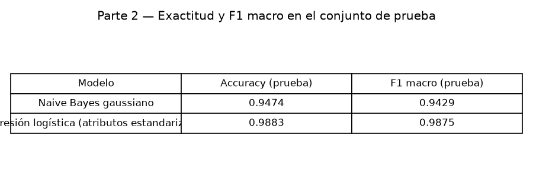
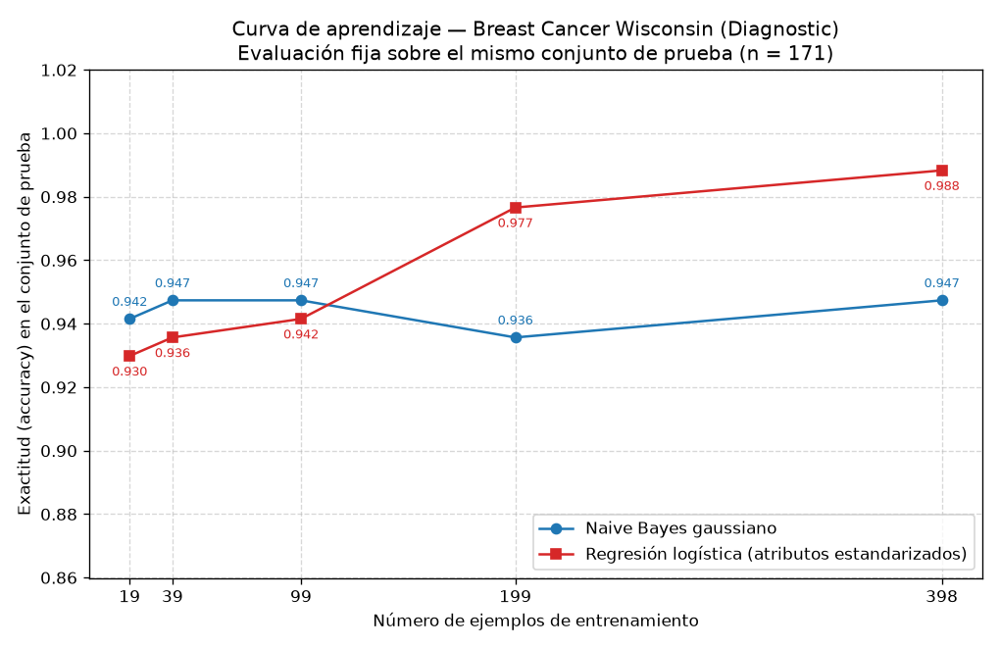

## Introducción

Ng y Jordan (2002) predijeron que un clasificador generativo alcanza su error asintótico con menos ejemplos que uno discriminativo, aunque ese error asintótico sea mayor. En esta tarea se contrasta esa predicción sobre datos reales del conjunto Breast Cancer Wisconsin (Diagnostic), enfrentando un clasificador generativo (Naive Bayes gaussiano) contra uno discriminativo (regresión logística) en una misma división entrenamiento/prueba, y trazando la curva de aprendizaje de ambos. Toda cifra de este reporte proviene de la ejecución del código entregado.

## Metodología

**Datos y división.** Se cargó el conjunto con `sklearn.datasets.load_breast_cancer`: 569 ejemplos, 30 atributos, con 212 casos malignant (clase 0) y 357 casos benign (clase 1). Se creó una única división 70/30 estratificada por clase con `random_state=42`: 398 ejemplos de entrenamiento (148 malignant, 250 benign) y 171 de prueba (64 malignant, 107 benign). El conjunto de prueba no se usó para ajustar nada en ninguna parte de la tarea.

**Modelos.** (1) Naive Bayes gaussiano sobre los atributos originales; (2) regresión logística precedida de un `StandardScaler` ajustado únicamente con los datos de entrenamiento. Se midieron exactitud (accuracy) y F1 macro sobre el conjunto de prueba.

**Curva de aprendizaje.** Sobre la misma división, se entrenaron ambos modelos con submuestras estratificadas del entrenamiento (`random_state=42`) de las fracciones 0.05, 0.1, 0.25, 0.5 y 1.0, equivalentes a 19, 39, 99, 199 y 398 ejemplos; el escalador de la regresión logística se reajustó con cada submuestra. Todos los puntos se evaluaron siempre sobre el mismo conjunto de prueba de 171 ejemplos y la figura se guardó como PNG.

## Resultados

**Parte 2 — Desempeño con el entrenamiento completo (398 ejemplos), conjunto de prueba:**

| Modelo | Accuracy | F1 macro |
|---|---|---|
| Naive Bayes gaussiano | 0.9474 | 0.9429 |
| Regresión logística (atributos estandarizados) | 0.9883 | 0.9875 |

**Parte 3 — Curva de aprendizaje (exactitud y F1 macro en el mismo conjunto de prueba):**

| Fracción | n entrenamiento | NB accuracy | NB F1 macro | RL accuracy | RL F1 macro |
|---|---|---|---|---|---|
| 5 % | 19 | 0.9415 | 0.9353 | 0.9298 | 0.9217 |
| 10 % | 39 | 0.9474 | 0.9420 | 0.9357 | 0.9285 |
| 25 % | 99 | 0.9474 | 0.9424 | 0.9415 | 0.9363 |
| 50 % | 199 | 0.9357 | 0.9302 | 0.9766 | 0.9747 |
| 100 % | 398 | 0.9474 | 0.9429 | 0.9883 | 0.9875 |

El punto de 100 % coincide con la tabla de la Parte 2 para ambos modelos, lo que confirma la consistencia del procedimiento.

## Discusión

**El cruce sí se observa.** Con 19 ejemplos el Naive Bayes alcanza 0.9415 y la regresión logística 0.9298; con 39, 0.9474 contra 0.9357; con 99, 0.9474 contra 0.9415: el generativo está por encima en los tres tamaños pequeños. Con 199 ejemplos la regresión logística pasa al frente (0.9766 contra 0.9357) y mantiene la ventaja con 398 ejemplos (0.9883 contra 0.9474). El cruce ocurre, por tanto, entre 99 y 199 ejemplos de entrenamiento, es decir, entre las fracciones 0.25 y 0.5 del entrenamiento disponible.

**El generativo converge pronto y se estanca.** La curva del Naive Bayes es esencialmente plana: ya con solo 19 ejemplos alcanza 0.9415, y con los 398 llega a 0.9474; en todo el rango su exactitud oscila entre 0.9357 (con 199) y 0.9474 (con 39, 99 y 398). Esto es exactamente el régimen de Ng y Jordan: el modelo generativo alcanza su error asintótico con muy pocos ejemplos, pero ese techo es más bajo que el del discriminativo (0.9474 contra 0.9883 de exactitud; 0.9429 contra 0.9875 de F1 macro). La pequeña caída en 199 ejemplos es ruido de muestreo de una única submuestra, no una tendencia: la curva vuelve a 0.9474 con 398.

**El discriminativo aprende más lento pero llega más lejos.** La regresión logística mejora de forma monótona: 0.9298, 0.9357, 0.9415, 0.9766 y 0.9883, y todavía mejora entre 199 y 398 ejemplos, señal de que no ha saturado.

**Lectura en términos de sesgo y varianza.** El Naive Bayes gaussiano impone un supuesto fuerte —independencia de los 30 atributos condicional a la clase—: tiene sesgo alto, lo que fija su error asintótico en un nivel peor, pero varianza baja, pues solo debe estimar medias y varianzas por atributo y clase, lo que logra con pocos datos; de ahí su curva plana desde 19 ejemplos. La regresión logística solo asume una frontera de decisión lineal en el espacio estandarizado: tiene sesgo menor (por eso su asíntota es mejor, 0.9883) pero varianza mayor, pues debe ajustar 30 coeficientes más el intercepto a partir de los datos; con 19 ejemplos eso la penaliza (0.9298, por debajo del generativo), y conforme aumentan los ejemplos la varianza se reduce y domina su menor sesgo. El patrón medido reproduce el compromiso teórico: el generativo compra convergencia rápida pagando con un piso de error más alto; el discriminativo paga con más datos y cobra con mejor desempeño final.

## Conclusiones

Sobre Breast Cancer Wisconsin con una única división 70/30 estratificada, los resultados confirman cualitativamente a Ng y Jordan (2002): el Naive Bayes gaussiano alcanza su régimen asintótico con muy pocos ejemplos (0.9415 de exactitud ya con 19, frente a 0.9474 con 398), mientras que la regresión logística necesita más datos pero lo supera a partir de entre 99 y 199 ejemplos y termina mejor (0.9883 de exactitud y 0.9875 de F1 macro contra 0.9474 y 0.9429). En la práctica: con presupuestos de entrenamiento pequeños (hasta 99 ejemplos aquí) conviene el modelo generativo; con datos suficientes (199 o más), el discriminativo. El comportamiento se explica por el intercambio sesgo-varianza: alto sesgo y baja varianza en el generativo frente a bajo sesgo y alta varianza en el discriminativo.
