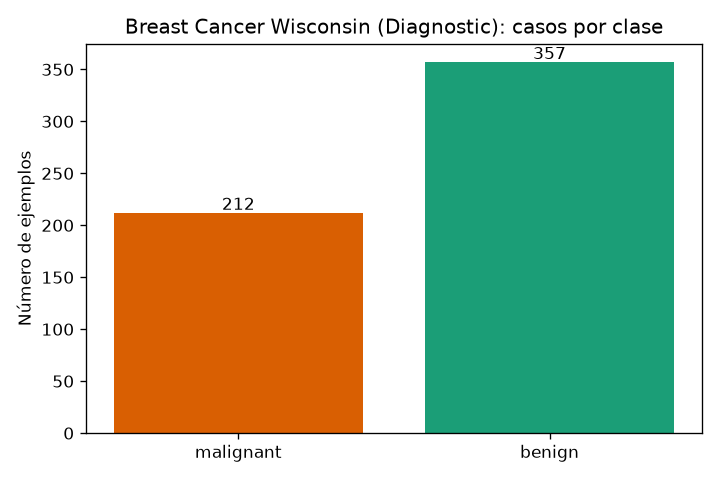
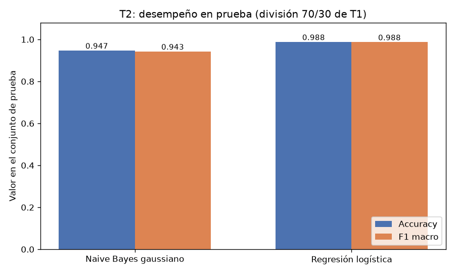
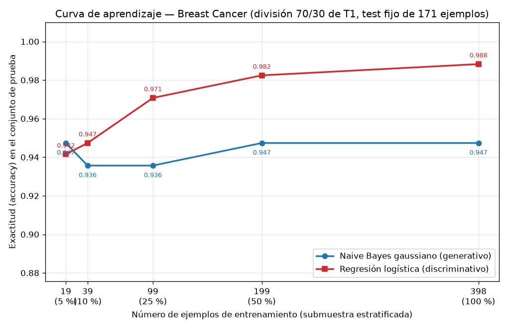

## Introducción

Ng y Jordan (2002) mostraron que un clasificador generativo puede alcanzar su error asintótico con menos ejemplos que uno discriminativo, aunque ese error asintótico sea mayor. Esta tarea comprueba esa predicción sobre datos reales comparando un Naive Bayes gaussiano (generativo) con una regresión logística (discriminativa) sobre el conjunto Breast Cancer Wisconsin (Diagnostic), mediante una curva de aprendizaje evaluada sobre una única división train/test que permanece intacta durante toda la tarea.

## Metodología

Se cargó `load_breast_cancer` de scikit-learn: 569 ejemplos, 30 atributos y 2 clases, con 212 casos malignos y 357 benignos. Se creó una única división 70/30 estratificada por clase con `random_state=42`, que produce 398 ejemplos de entrenamiento (148 malignos, 250 benignos) y 171 de prueba (64 malignos, 107 benignos). El conjunto de prueba no se usó para ajustar nada en ninguna parte de la tarea.

Se entrenaron dos modelos: un `GaussianNB` con valores por defecto y un `Pipeline(StandardScaler(), LogisticRegression(max_iter=1000))`, donde el escalador se ajusta únicamente con los datos de entrenamiento. Para la curva de aprendizaje, ambos modelos se entrenaron con submuestras estratificadas del 5 %, 10 %, 25 %, 50 % y 100 % del entrenamiento (`random_state=42`), correspondientes a 19, 39, 99, 199 y 398 ejemplos, y cada modelo se evaluó siempre sobre el mismo conjunto de prueba. Se reportan exactitud (accuracy) y F1 macro.

## Resultados

**Comparación con el entrenamiento completo (Parte 2).** Con los 398 ejemplos de entrenamiento:

| Modelo | Accuracy (prueba) | F1 macro (prueba) |
|---|---|---|
| Naive Bayes gaussiano | 0.9474 | 0.9429 |
| Regresión logística | 0.9883 | 0.9875 |

La regresión logística supera al Naive Bayes en ambas métricas. Las matrices de confusión lo explican: el Naive Bayes comete 7 falsos negativos (malignos clasificados como benignos) y 2 falsos positivos, mientras que la regresión logística comete solo 1 de cada uno.

**Curva de aprendizaje (Parte 3).** Exactitud y F1 macro en el conjunto de prueba fijo:

| n entrenamiento | % | Accuracy NB | Accuracy RL | F1 macro NB | F1 macro RL |
|---|---|---|---|---|---|
| 19 | 5 | 0.9474 | 0.9415 | 0.9429 | 0.9363 |
| 39 | 10 | 0.9357 | 0.9474 | 0.9302 | 0.9436 |
| 99 | 25 | 0.9357 | 0.9708 | 0.9307 | 0.9689 |
| 199 | 50 | 0.9474 | 0.9825 | 0.9424 | 0.9812 |
| 398 | 100 | 0.9474 | 0.9883 | 0.9429 | 0.9875 |

La fila de 398 ejemplos coincide con la tabla de la Parte 2, lo que confirma la consistencia del protocolo. 

## Discusión

El cruce predicho por Ng y Jordan sí se observa con estas cifras. Con la submuestra más pequeña (19 ejemplos: 7 malignos y 12 benignos), el Naive Bayes gana: 0.9474 frente a 0.9415 de la regresión logística. Con 39 ejemplos el orden se invierte (0.9357 frente a 0.9474) y a partir de ahí el modelo discriminativo domina en todos los tamaños restantes. El cruce ocurre, por tanto, entre 19 y 39 ejemplos de entrenamiento.

El comportamiento de cada curva ilustra el papel del sesgo y la varianza. El Naive Bayes gaussiano impone un sesgo inductivo fuerte: asume que los 30 atributos son independientes condicionalmente a la clase. Eso reduce drásticamente los parámetros a estimar (medias y varianzas por clase y atributo) y le da baja varianza: alcanza su mejor exactitud (0.9474) ya con 19 ejemplos y nunca la supera; a lo largo de toda la curva se mueve en un rango estrecho (0.9357–0.9474). Su error asintótico, en cambio, es mayor: se estanca en 0.9474 mientras la regresión logística llega a 0.9883, porque el supuesto de independencia condicional no se cumple exactamente en estos datos.

La regresión logística tiene menor sesgo: no modela la distribución conjunta de los atributos y solo ajusta una frontera de decisión lineal. Eso implica mayor varianza y más datos para converger: con 19 ejemplos es la peor de las dos (0.9415), pero su exactitud crece de forma monótona (0.9415 → 0.9474 → 0.9708 → 0.9825 → 0.9883) y supera el techo del modelo generativo desde los 39 ejemplos. El F1 macro sigue el mismo patrón (0.9363 → 0.9875), lo que muestra que la ventaja no proviene solo de la clase mayoritaria: el modelo discriminativo también reconoce mejor la clase minoritaria maligna, reduciendo los falsos negativos de 7 (Naive Bayes) a 1 con el entrenamiento completo.

En síntesis: con muy pocos datos conviene el modelo generativo (mejor con 19 ejemplos); con 39 o más conviene el discriminativo, y su ventaja crece con el tamaño de entrenamiento. Esta es exactamente la asimetría de Ng y Jordan: el generativo converge antes (baja varianza) pero hacia un error asintótico peor (alto sesgo); el discriminativo converge más despacio (alta varianza) pero hacia un error asintótico menor (bajo sesgo).

## Conclusiones

Sobre Breast Cancer Wisconsin, con una única división 70/30 estratificada (`random_state=42`) y evaluación fija en prueba, los resultados reproducen cualitativamente a Ng y Jordan (2002). El Naive Bayes gaussiano alcanza su exactitud asintótica (0.9474) con solo 19 ejemplos y la mantiene en todo el rango evaluado, mientras que la regresión logística parte por debajo (0.9415) con ese mismo tamaño, lo supera a partir de 39 ejemplos y mejora de manera sostenida hasta 0.9883 de exactitud y 0.9875 de F1 macro con los 398 ejemplos disponibles. La lectura en términos de sesgo y varianza es directa: el sesgo fuerte del generativo compra rapidez de convergencia a costa de un piso de error más alto; la mayor flexibilidad del discriminativo exige más datos pero rinde más cuando los tiene. Para este problema, con cientos de ejemplos disponibles, la regresión logística es la elección preferente; el generativo solo sería preferible en regímenes de datos extremadamente escasos (del orden de las primeras decenas de ejemplos).
