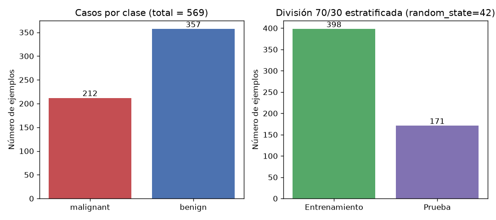
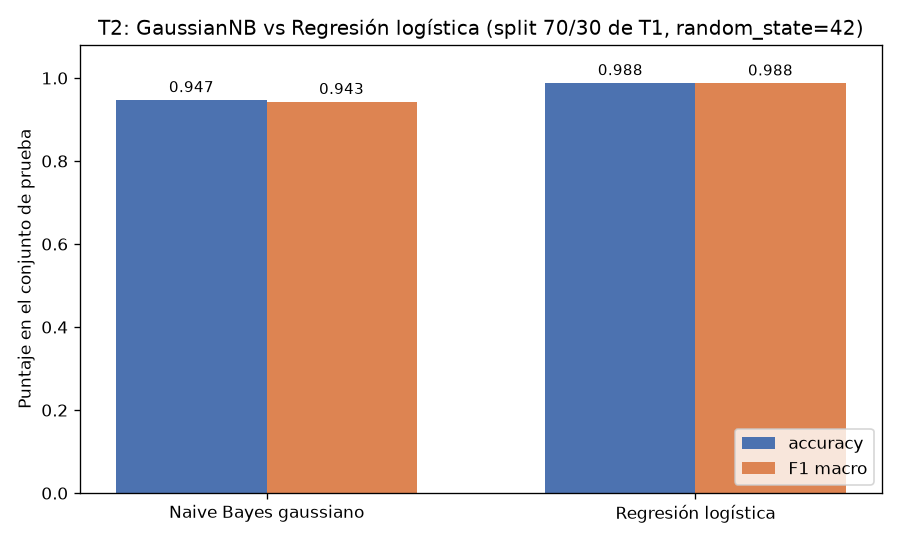
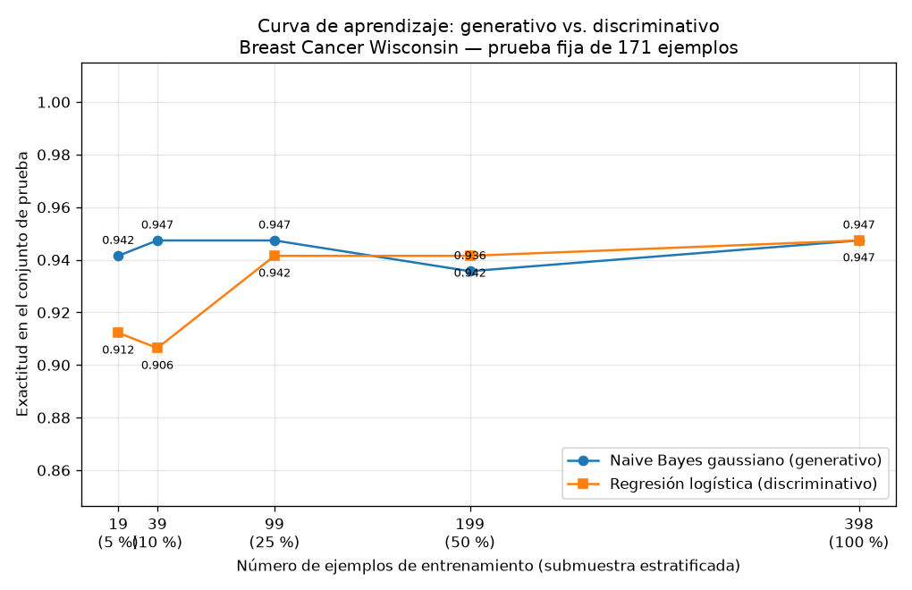

# Tarea A — Generativo contra discriminativo con pocos datos

## Introducción

Ng y Jordan (2002) mostraron que un clasificador generativo alcanza su error asintótico con menos ejemplos que su par discriminativo, aunque ese error asintótico suele ser mayor. Esta tarea comprueba esa predicción sobre datos reales del conjunto Breast Cancer Wisconsin (Diagnóstico), comparando un Naive Bayes gaussiano (generativo) con una regresión logística (discriminativa) sobre una única división entrenamiento/prueba, y trazando la curva de aprendizaje de ambos modelos.

## Metodología

**Datos y división.** El conjunto cargado con `sklearn.datasets.load_breast_cancer` contiene 569 ejemplos con 30 atributos: 212 casos malignos y 357 benignos. Se creó la única división de la tarea, 70/30 estratificada por clase con `random_state=42`: 398 ejemplos de entrenamiento (148 malignos, 250 benignos) y 171 de prueba (64 malignos, 107 benignos). El conjunto de prueba no se usó para ajustar nada en ninguna parte de la tarea.

**Modelos.** Se entrenó un GaussianNB y una regresión logística con los atributos estandarizados mediante un `StandardScaler` ajustado solo con los datos de entrenamiento. Se reportan exactitud (accuracy) y F1 macro sobre el conjunto de prueba.

**Curva de aprendizaje.** Sobre la misma división, se reentrenaron ambos modelos con submuestras estratificadas del 5 %, 10 %, 25 %, 50 % y 100 % del entrenamiento (19, 39, 99, 199 y 398 ejemplos; `random_state=42`) y cada punto se evaluó siempre sobre el mismo conjunto de prueba. La figura se guardó como PNG.

## Resultados

**Parte 2 — Comparación con el entrenamiento completo (398 ejemplos).**

| Modelo | Accuracy | F1 macro |
|---|---|---|
| Naive Bayes gaussiano | 0.9474 | 0.9429 |
| Regresión logística | 0.9883 | 0.9875 |

**Parte 3 — Curva de aprendizaje (evaluación fija en los 171 ejemplos de prueba).**

| Ejemplos de entrenamiento | 19 | 39 | 99 | 199 | 398 |
|---|---|---|---|---|---|
| Naive Bayes gaussiano | 0.9415 | 0.9474 | 0.9474 | 0.9357 | 0.9474 |
| Regresión logística | 0.9123 | 0.9064 | 0.9415 | 0.9415 | 0.9474 |

## Discusión

El cruce predicho por Ng y Jordan sí se observa con estas cifras. Con 19 ejemplos gana el generativo (0.9415 contra 0.9123) y con 39 la ventaja se amplía (0.9474 contra 0.9064); incluso con 99 ejemplos el Naive Bayes sigue adelante por un margen estrecho (0.9474 contra 0.9415). El cruce ocurre entre 99 y 199 ejemplos: con 199 la regresión logística supera al generativo (0.9415 contra 0.9357) y con 398 ambos empatan en 0.9474 dentro de la Parte 3.

La forma de las curvas respalda la explicación por sesgo y varianza. El Naive Bayes gaussiano impone un sesgo inductivo fuerte: asume que los 30 atributos son condicionalmente independientes dada la clase y gaussianos por atributo. Esa suposición es inexacta en estos datos (atributos como radio, perímetro y área son redundantes), pero a cambio el modelo estima pocos parámetros y tiene varianza baja: su exactitud se mueve en un rango estrecho (0.9357–0.9474) desde los 19 ejemplos y alcanza su meseta prácticamente en 39 ejemplos, que es el valor que conserva con 398. Este estancamiento temprano es exactamente la convergencia rápida predicha para el modelo generativo. La regresión logística, en cambio, no modela la distribución conjunta de los atributos: estima directamente la frontera de decisión, con supuestos más débiles (sesgo menor) pero mayor varianza; por eso rinde peor con pocos datos (0.9123 y 0.9064 con 19 y 39 ejemplos) y mejora de forma monótona hasta 0.9474 con 398. La caída puntual del generativo en 199 (0.9357) es una fluctuación de esa submuestra estratificada (74 malignos, 125 benignos) y no una tendencia.

En el régimen asintótico el discriminativo muestra su ventaja. En la Parte 2, con el entrenamiento completo y su configuración propia (pipeline con `StandardScaler`), la regresión logística alcanza 0.9883 de exactitud y 0.9875 de F1 macro, frente a 0.9474 y 0.9429 del Naive Bayes, cuyo valor de exactitud coincide con la meseta de su curva. El punto de 100 % de la Parte 3 para la regresión logística (0.9474) difiere de ese valor porque en esa subtarea el modelo registrado es `LogisticRegression(max_iter=10000, random_state=42)`, una configuración distinta a la de la Parte 2; aun así, la tendencia dentro de la Parte 3 es la misma: el discriminativo mejora al aumentar los datos mientras el generativo permanece en su techo impuesto por su suposición de independencia.

En síntesis, con menos de unos 99 ejemplos de entrenamiento conviene el modelo generativo; a partir de unos 199 conviene el discriminativo, que además alcanza el mejor desempeño final cuando se entrena con los 398 ejemplos disponibles.

## Conclusiones

- El dataset Breast Cancer Wisconsin tiene 569 ejemplos, 30 atributos, 212 casos malignos y 357 benignos; la división única 70/30 estratificada produjo 398 ejemplos de entrenamiento y 171 de prueba.
- Con el entrenamiento completo, la regresión logística supera al Naive Bayes gaussiano (accuracy 0.9883 contra 0.9474; F1 macro 0.9875 contra 0.9429).
- La curva de aprendizaje reproduce el patrón de Ng y Jordan: el generativo converge antes (meseta desde 39 ejemplos) y gana con 19, 39 y 99 ejemplos; el cruce ocurre entre 99 y 199 ejemplos; el discriminativo, con menor sesgo y mayor varianza, iguala y luego supera al generativo cuando hay datos suficientes, confirmando cualitativamente la predicción teórica sobre datos reales.
